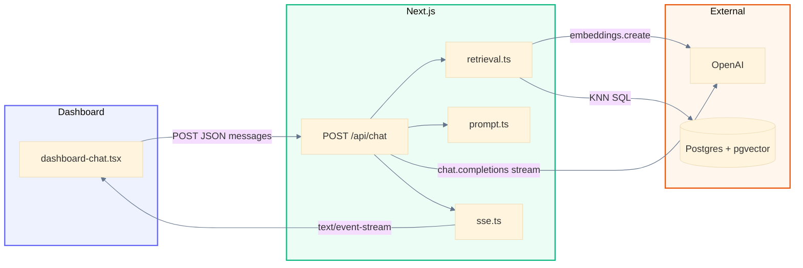
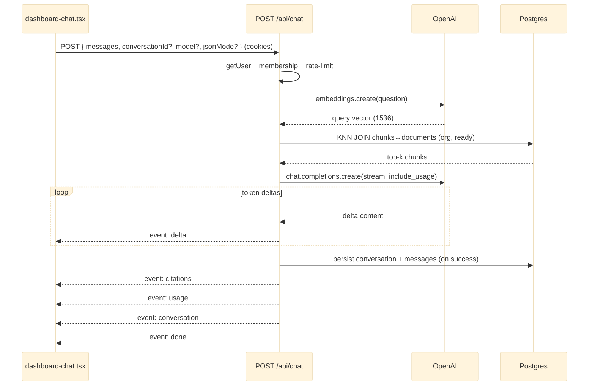
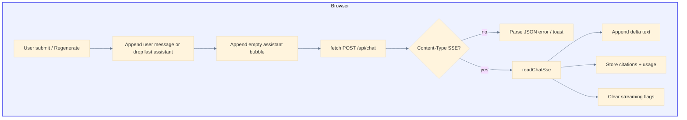

# AI Chat (streaming RAG)

An authenticated user can **ask questions about their organization’s ready documents** and receive a **streaming** answer grounded in retrieved PDF chunks. The web app posts to `POST /api/chat`, which embeds the question, runs org-scoped vector KNN in Postgres from Next.js, then streams an OpenAI chat completion as **Server-Sent Events (SSE)**. There is no Vercel AI SDK — streaming uses the `openai` package and a manual `ReadableStream` (Approach B).

Related material: [Document ingest pipeline](document-ingest-pipeline.md) (chunks + embeddings that chat retrieves), [Document management](document-management.md) (upload / open), [Authentication](authentication.md) (session and org scoping).

Diagrams use [Mermaid](https://mermaid.js.org/).

---

## Goals

1. Answers are **grounded** in org-scoped `document_chunks` (only `processing_status = 'ready'` docs).
2. Tokens appear **incrementally** in the dashboard (SSE `delta` events).
3. Auth, membership, and rate limiting match other document APIs.
4. Retrieval and chat policy live in the **Next.js** tier (parameterized SQL), not in a Postgres RPC.
5. Conversations and messages are **persisted** (org-scoped RLS); history survives refresh; the footer uses durable org-wide token totals.

---

## Implementation map

| Topic | Path |
|--------|------|
| Dashboard UI | `apps/web/src/app/dashboard/dashboard-chat.tsx` |
| Chat API (SSE) | `apps/web/src/app/api/chat/route.ts` |
| Conversations list / create | `apps/web/src/app/api/conversations/route.ts` |
| Conversation detail | `apps/web/src/app/api/conversations/[conversationId]/route.ts` |
| Prompt templates list / create | `apps/web/src/app/api/prompt-templates/route.ts` |
| Prompt template update / delete | `apps/web/src/app/api/prompt-templates/[id]/route.ts` |
| Prompt templates schema | `supabase/migrations/20260726130000_prompt_templates.sql` |
| Persist helpers | `apps/web/src/lib/chat/persist.ts` |
| Conversation DTOs | `apps/web/src/types/conversation.ts` |
| OpenAI client | `apps/web/src/lib/chat/openai.ts` |
| Allowlisted chat models | `apps/web/src/lib/chat/models.ts` |
| Vector retrieval (embed + KNN SQL) | `apps/web/src/lib/chat/retrieval.ts` |
| System prompt + citations helpers | `apps/web/src/lib/chat/prompt.ts` |
| Shared types (citations, usage, SSE) | `apps/web/src/lib/chat/types.ts` |
| Server SSE framing | `apps/web/src/lib/chat/sse.ts` |
| Client SSE reader | `apps/web/src/lib/chat/read-sse.ts` |
| Usage estimate fallback | `apps/web/src/lib/chat/estimate-usage.ts` |
| Monthly usage cap helper | `apps/web/src/lib/chat/usage-cap.ts` |
| Session token context | `apps/web/src/app/dashboard/chat-session-context.tsx` |
| Token budget footer | `apps/web/src/app/dashboard/token-budget-footer.tsx` |
| Org settings API (token budget) | `apps/web/src/app/api/organization/route.ts` |
| Org token budget schema | `supabase/migrations/20260725125628_org_token_budget.sql` |
| Server Postgres client | `apps/web/src/lib/db/postgres.ts` |
| Rate limiting | `apps/web/src/lib/rate-limit.ts` |
| HNSW index on embeddings | `supabase/migrations/20260720003050_match_document_chunks_rpc.sql` (index retained; any early RPC dropped later) |
| Conversations / messages schema | `supabase/migrations/20260725180000_chat_conversations.sql` |

---

## Environment variables

| Variable | Role |
|----------|------|
| `OPENAI_API_KEY` | **Server only**. Embeddings + chat completions on the web tier. |
| `CHAT_MODEL` | Optional. Fallback completion model when the request omits `model` (default `gpt-4o-mini`). Request `model` must still be an allowlisted id from `models.ts`. |
| `CHAT_EMBEDDING_MODEL` | Optional. Must match the worker (`text-embedding-3-small`, 1536 dims). |
| `RAG_MATCH_COUNT` | Optional. Top-k chunks for retrieval (default `6`, clamped 1–32). |
| `DATABASE_URL` | **Server only**. Supabase Postgres/pooler URI for pgvector KNN. Never `NEXT_PUBLIC_`. |
| `NEXT_PUBLIC_SUPABASE_URL` / `NEXT_PUBLIC_SUPABASE_PUBLISHABLE_KEY` | Session auth via Supabase (same as other APIs). |

---

## Architecture (high level)

Chat is a **request-scoped RAG loop** inside Next.js: authenticate → rate-limit → embed question → KNN SQL → stream completion. It reuses embeddings produced by the [ingest worker](document-ingest-pipeline.md); it does not call the worker at ask time.



**Paths**

- **Ask (primary):** the browser POSTs `{ messages, conversationId? }` with session cookies; the route resolves the user and `organization_id`, embeds the last user question, retrieves top-k chunks, then streams SSE events until `done` or `error`. On success it persists the turn (auto-creating a conversation when `conversationId` is omitted).
- **History:** `GET /api/conversations` lists the user’s chats + org token sum; `GET /api/conversations/:id` loads messages for the sidebar.
- **Abort:** the client aborts `fetch` (unmount or a new send); the route observes `request.signal` and stops enqueueing further events (nothing is persisted until a successful completion).
- **Preflight failures:** auth, validation, rate limit, and missing config return **JSON** `{ error }` (not SSE) with the appropriate status.

---

## Streaming request lifecycle



---

## Backend: `POST /api/chat`

Handler: `apps/web/src/app/api/chat/route.ts`.

### 1. Gatekeeping (before the stream)

Same pattern as document APIs:

1. `createClient()` → `auth.getUser()` → **401** if missing.
2. `checkRateLimit(\`chat:${user.id}\`, 20 / 60s)` → **429** + `Retry-After` if exceeded.
3. `memberships.select("organization_id")` → **400** if no org.
4. Load `organizations.system_prompt` for that org (null/empty → built-in `RAG_SYSTEM_PROMPT`). The chat body does **not** accept a client system prompt; source of truth is the org row.
5. Parse/validate body: non-empty `messages` (max 40), each `{ role: "user" | "assistant", content }` (max 8 000 chars, trimmed non-empty); optional `conversationId` (UUID); optional `regenerate: true` (requires `conversationId`); optional `model` (must be an allowlisted id from `lib/chat/models.ts` — currently `gpt-4o-mini`, `gpt-5-mini`, `gpt-5-nano`, `gpt-4.1-nano`; invalid → **400**). Omitted/`null`/empty → `CHAT_MODEL` env or `gpt-4o-mini`. Optional `jsonMode` (boolean; non-boolean → **400**). `true` forces structured JSON (see below); omitted/`false` → normal prose.
6. Last **user** message is the retrieval query; missing user turn → **400**.
7. If `conversationId` is set, verify the conversation belongs to the user in their org → **404** / **500** otherwise.

**Org system prompt:** Owners set it via `PATCH /api/organization` `{ systemPrompt }` (string, max 8 000; `null` resets to built-in) → **403** for non-owners. `GET /api/organization` returns `systemPrompt` for the UI. Stored on `organizations.system_prompt` and applies to every member’s chats. A `BEFORE UPDATE` trigger also blocks non-owner changes to `system_prompt` even if RLS allows other org column updates.

Misconfiguration (`OPENAI_API_KEY` / `DATABASE_URL`) before the stream starts returns JSON **500** `"Chat is not configured"`. Failures after the stream opens emit a terminal SSE `error` event instead.

### 2. Retrieval (Next.js SQL)

`retrieveRelevantChunks` (`lib/chat/retrieval.ts`):

1. Embed the question with `CHAT_EMBEDDING_MODEL` / 1536 dims (must match ingest).
2. Run parameterized cosine KNN via the server Postgres client (`DATABASE_URL`):

   - Join `document_chunks` → `documents`.
   - Filter `organization_id` and `processing_status = 'ready'`.
   - `ORDER BY embedding <=> query_vector LIMIT k`.
   - Similarity exposed as `1 − distance`.

**Why not a `match_document_chunks` RPC?** PostgREST cannot express `ORDER BY embedding <=> $1` without a DB function, and putting auth/retrieval in a `SECURITY DEFINER` RPC couples chat policy to migrations. Schema owns the **HNSW index**; the app owns the **query**. Org filter in SQL is the primary gate; RLS remains defense-in-depth.

### 3. Prompt assembly

`buildRagMessages` (`lib/chat/prompt.ts`) builds a **single-turn** completion:

- **System:** instruction block + labeled chunk excerpts (document name, optional page, similarity). Instruction block is `organizations.system_prompt` when set; otherwise the built-in `RAG_SYSTEM_PROMPT`. Document context is always appended. When `jsonMode` is true, also appends `Respond with valid JSON only.`
- **User:** the last question.

The default instructions tell the model to answer only from context and to say when the documents do not contain the answer. `chunksToCitations` dedupes by `documentId` + page (cap 8) for the later `citations` event.

**JSON mode:** Any org member can toggle it in the composer (client-side only; not stored on `messages` rows). When `jsonMode: true`, the API (1) appends the JSON-only instruction above and (2) passes `response_format: { type: "json_object" }` to OpenAI. Citations / usage / conversation SSE events are unchanged. Toggle off → normal prose completion (no `response_format`).

### 4. OpenAI stream → SSE

After retrieval, the handler returns `Content-Type: text/event-stream` and a `ReadableStream` that:

1. Calls `chat.completions.create({ model, stream: true, stream_options: { include_usage: true }, response_format? })` with `request.signal`. `model` is the allowlisted body value when present, otherwise `getChatModel()` (`CHAT_MODEL` / `gpt-4o-mini`). When `jsonMode` is true, includes `response_format: { type: "json_object" }`.
2. For each chunk with `delta.content`, enqueues `delta`.
3. Captures `usage` from the final provider chunk when present (`stream_options.include_usage`). If the provider omits usage (or returns zeros), falls back to a chars/4 estimate over the RAG prompt texts + accumulated completion (`estimateChatUsage`).
4. If the client aborted, closes without terminal events (and **without** persisting).
5. If no text arrived, enqueues `error` (`Empty completion from model`).
6. On success: create conversation if needed (or, when `regenerate`, delete the last assistant message), insert user + assistant rows (skip user on regenerate), then enqueue `citations` → `usage` → `conversation` → `done`.

Server framing helper: `formatSseEvent` in `lib/chat/sse.ts`. Response headers disable buffering (`Cache-Control: private, no-store`, `X-Accel-Buffering: no`). Persist helpers live in `lib/chat/persist.ts`.

### Conversation APIs

| Method | Path | Behavior |
|--------|------|----------|
| `GET` | `/api/conversations` | Current user’s conversations (newest `updated_at` first) + `orgTokensUsed` (sum of assistant `total_tokens` in the org). |
| `POST` | `/api/conversations` | Optional empty conversation create (`{ title? }`). Chat also auto-creates on first successful turn. |
| `GET` | `/api/conversations/:id` | Conversation + ordered messages (owner only within org). |

Schema: `conversations` / `messages` with org-scoped RLS (`supabase/migrations/20260725180000_chat_conversations.sql`).

### Prompt template APIs

Org-scoped saved prompts shared by **all members** (no owner gate). Auth + membership required; RLS mirrors membership.

| Method | Path | Behavior |
|--------|------|----------|
| `GET` | `/api/prompt-templates` | List templates for the current org (newest `updated_at` first). |
| `POST` | `/api/prompt-templates` | Create `{ name?, body }` (`name` ≤ 120, `body` ≤ 8 000; empty name → first 40 chars of body). |
| `PATCH` | `/api/prompt-templates/:id` | Update `name` and/or `body` (same limits). |
| `DELETE` | `/api/prompt-templates/:id` | Delete. |

Response shape: `{ id, name, body, updatedAt }` (list wraps as `{ templates }`, create/update as `{ template }`). The dashboard loads them via `ChatControlsProvider`; model / JSON mode stay in localStorage.

---

## SSE event contract

Wire format (one frame per event):

```text
event: <type>
data: <json>

```

| Event | When | Payload |
|--------|------|---------|
| `delta` | Each token batch from the model | `{ "type": "delta", "text": "…" }` |
| `citations` | After a non-empty completion + successful persist | `{ "type": "citations", "citations": [{ documentId, documentName, page }] }` |
| `usage` | After citations | `{ "type": "usage", "usage": { promptTokens, completionTokens, totalTokens } }` |
| `conversation` | After persist, before `done` | `{ "type": "conversation", "conversationId": "…", "title": "…" }` |
| `done` | Success terminal | `{ "type": "done", "conversationId": "…" }` |
| `error` | Failure terminal (in-stream) | `{ "type": "error", "error": "…" }` |

Non-2xx / non-stream failures stay JSON: `{ "error": "…" }`.

---

## Frontend: dashboard chat

UI: `apps/web/src/app/dashboard/dashboard-chat.tsx`. Client parser: `readChatSse` in `lib/chat/read-sse.ts`.

### Session state

- Active conversation held in client state (`conversationId` + `messages`), seeded from a placeholder welcome assistant message for new chats.
- “Chat History” sidebar loads from `GET /api/conversations`; selecting an item loads `GET /api/conversations/:id`. **New chat** clears the active conversation.
- Concurrent sends are blocked while `isStreaming` is true; a new stream aborts any prior `AbortController`.

### Streaming client flow



1. On submit, append the user turn and call `streamChat(toApiMessages(...))` (strips the welcome message).
2. Create an empty assistant message; show “Assistant is thinking…” until the first `delta`.
3. `fetch("/api/chat", { credentials: "include", signal, body: { messages, conversationId, regenerate?, model?, jsonMode? } })`. Model and JSON mode come from chat controls (localStorage via `ChatControlsProvider`); model ids are allowlisted. `jsonMode: true` forces structured JSON from the API. Prompt templates are org-scoped via `/api/prompt-templates` (not localStorage).
4. If the response is not `text/event-stream`, treat the body as JSON error.
5. Otherwise `readChatSse` buffers network chunks, splits on `\n\n`, and dispatches typed events:
   - `delta` → append text to the assistant bubble
   - `citations` → patch that message and render a compact **Sources** list (document name + optional page) linking to `/api/documents/:id/open` in a new tab; omitted when the array is empty
   - `usage` → patch that message; show per-reply token count; adjust durable org total in `ChatSessionProvider`
   - `conversation` / `done` → store `conversationId`; invalidate the history query
   - `error` → fail the turn (remove empty assistant, toast)
6. On abort (unmount or superseded request), ignore follow-up errors; release the reader.

### Regenerate

- A **Regenerate** control appears on the **last** assistant message only (not the welcome placeholder).
- Clicking it drops that assistant turn and re-POSTs the prior messages with `regenerate: true` (requires a persisted `conversationId`).
- On success the API deletes the previous assistant row, then inserts the replacement (usage + citations updated).
- Disabled while `isStreaming` is true (same concurrency guard as send).
- Footer tokens adjust by `newTotal − oldTotal`, then reconcile from `orgTokensUsed` on history refetch.

### Token usage (org monthly meter + per-session cost)

- Each assistant reply shows its `usage.totalTokens` once the `usage` event arrives.
- `ChatSessionProvider` holds `sessionTokensUsed` seeded from `GET /api/conversations` → `orgTokensUsed` (sum of assistant `total_tokens` across the org).
- Streaming adjusts that total immediately; history refetch reconciles from the database.
- `TokenBudgetFooter` presents that sum as **this month** vs the org **monthly cap** (`organizations.token_budget`, editable via `PATCH /api/organization`). Cost uses `tokensUsed / 1000 * costPerThousandTokens` (default `0.01`). Default cap is `1000`. (Period reset is still UI copy; the meter uses the lifetime org aggregate until a calendar window is added.)
- Soft block when usage ≥ cap: composer shows a banner and disables send/regenerate; `POST /api/chat` returns **403** with the same message before retrieval/completion. Raising the cap via the footer modal unblocks. An in-flight stream that crosses the cap is allowed to finish; the next request is blocked.
- The active chat header shows **Session · N tokens · $X.XX**, summed from assistant `usage` on the open conversation and recomputed when a stream (or regenerate) delivers a new `usage` event.

`EventSource` is not used because the request is a **POST** with a JSON body.

---

## Design notes

| Decision | Rationale |
|----------|-----------|
| Approach B (manual SSE + `openai`) | Reuses the same SDK as the document worker; no Vercel AI SDK dependency; full control of event order (`delta` → `citations` → `usage` → `done`). |
| Retrieval in Next.js | Keeps chat policy next to the route; migrations stay schema-only (HNSW index). |
| Single-turn RAG prompt today | System + last user question + retrieved context. Full multi-turn history is accepted on the wire for future use; the completion prompt currently grounds on the latest question. |
| Persist on successful `done` only | Avoids empty conversations / lost regenerates when the stream aborts or errors mid-flight. |
| Org-scoped RLS + owner-filtered list | RLS mirrors documents (org membership); list/detail APIs further scope to the current `user_id`. |

---

## Current status

Shipped relative to the Phase 1 plan:

- Org-scoped RAG ask + **streaming** SSE (backend + incremental UI).
- **Sources** under each assistant reply: deduped citations (`documentId` + page) link to `/api/documents/:id/open`. Hidden when retrieval returned no chunks.
- **Token usage** per assistant reply + durable org aggregate in the budget footer (provider usage with estimate fallback).
- **Regenerate** on the last assistant turn (re-streams; DB + footer usage replace the old reply).
- **Persisted conversations** with history sidebar, reload-after-refresh, and org-scoped RLS.

| Checkpoint | Status |
|------------|--------|
| CP1 Non-streaming RAG → evolved into streaming route | Done (superseded by CP2 shape) |
| CP2 Streaming API + client reader | Done |
| CP3 Sources UI (links to `/api/documents/:id/open`) | Done |
| CP4 Token usage in footer / per-message display | Done |
| CP5 Regenerate last turn | Done |
| CP6 Persist conversations / messages | Done |

---

## See also

- [Document ingest pipeline](document-ingest-pipeline.md) — how chunks and embeddings are produced
- [Document management](document-management.md) — upload, open (signed URL), delete
- [Authentication](authentication.md) — cookie session shared by browser and API routes
- [Supabase](supabase.md) — migrations and local workflow
