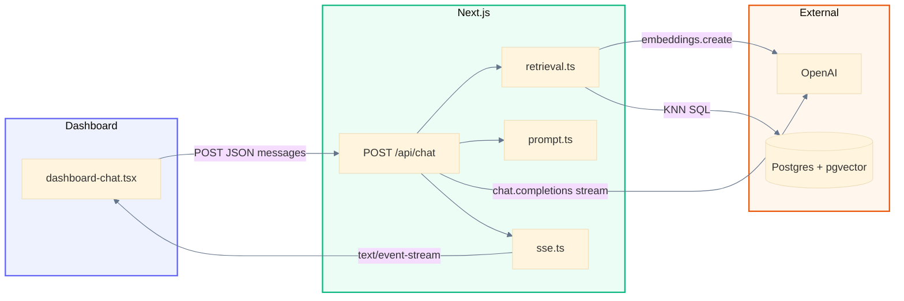
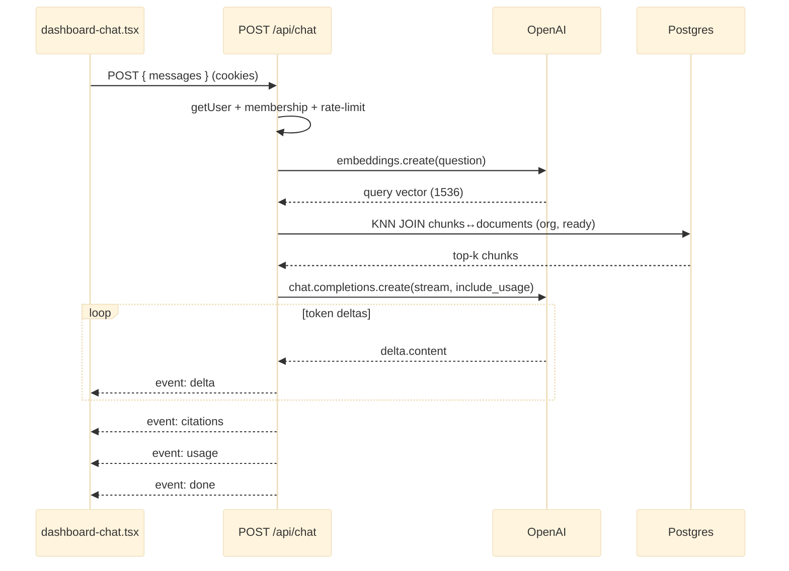
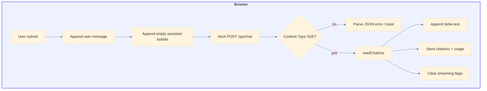

# AI Chat (streaming RAG)

An authenticated user can **ask questions about their organization’s ready documents** and receive a **streaming** answer grounded in retrieved PDF chunks. The web app posts to `POST /api/chat`, which embeds the question, runs org-scoped vector KNN in Postgres from Next.js, then streams an OpenAI chat completion as **Server-Sent Events (SSE)**. There is no Vercel AI SDK — streaming uses the `openai` package and a manual `ReadableStream` (Approach B).

Related material: [Document ingest pipeline](document-ingest-pipeline.md) (chunks + embeddings that chat retrieves), [Document management](document-management.md) (upload / open), [Authentication](authentication.md) (session and org scoping).

Diagrams use [Mermaid](https://mermaid.js.org/).

---

## Goals

1. Answers are **grounded** in org-scoped `document_chunks` (only `processing_status = 'ready'` docs).
2. Tokens appear **incrementally** in the dashboard (SSE `delta` events).
3. Auth, membership, and rate limiting match other document APIs.
4. Retrieval and chat policy live in the **Next.js** tier (parameterized SQL), not in a Postgres RPC.
5. Message history is **session-only** in the browser for now (no conversation tables yet).

---

## Implementation map

| Topic | Path |
|--------|------|
| Dashboard UI | `apps/web/src/app/dashboard/dashboard-chat.tsx` |
| Chat API (SSE) | `apps/web/src/app/api/chat/route.ts` |
| OpenAI client / models | `apps/web/src/lib/chat/openai.ts` |
| Vector retrieval (embed + KNN SQL) | `apps/web/src/lib/chat/retrieval.ts` |
| System prompt + citations helpers | `apps/web/src/lib/chat/prompt.ts` |
| Shared types (citations, usage, SSE) | `apps/web/src/lib/chat/types.ts` |
| Server SSE framing | `apps/web/src/lib/chat/sse.ts` |
| Client SSE reader | `apps/web/src/lib/chat/read-sse.ts` |
| Server Postgres client | `apps/web/src/lib/db/postgres.ts` |
| Rate limiting | `apps/web/src/lib/rate-limit.ts` |
| HNSW index on embeddings | `supabase/migrations/20260720003050_match_document_chunks_rpc.sql` (index retained; any early RPC dropped later) |

---

## Environment variables

| Variable | Role |
|----------|------|
| `OPENAI_API_KEY` | **Server only**. Embeddings + chat completions on the web tier. |
| `CHAT_MODEL` | Optional. Completion model (default `gpt-4o-mini`). |
| `CHAT_EMBEDDING_MODEL` | Optional. Must match the worker (`text-embedding-3-small`, 1536 dims). |
| `RAG_MATCH_COUNT` | Optional. Top-k chunks for retrieval (default `6`, clamped 1–32). |
| `DATABASE_URL` | **Server only**. Supabase Postgres/pooler URI for pgvector KNN. Never `NEXT_PUBLIC_`. |
| `NEXT_PUBLIC_SUPABASE_URL` / `NEXT_PUBLIC_SUPABASE_PUBLISHABLE_KEY` | Session auth via Supabase (same as other APIs). |

---

## Architecture (high level)

Chat is a **request-scoped RAG loop** inside Next.js: authenticate → rate-limit → embed question → KNN SQL → stream completion. It reuses embeddings produced by the [ingest worker](document-ingest-pipeline.md); it does not call the worker at ask time.



**Paths**

- **Ask (primary):** the browser POSTs `{ messages }` with session cookies; the route resolves the user and `organization_id`, embeds the last user question, retrieves top-k chunks, then streams SSE events until `done` or `error`.
- **Abort:** the client aborts `fetch` (unmount or a new send); the route observes `request.signal` and stops enqueueing further events.
- **Preflight failures:** auth, validation, rate limit, and missing config return **JSON** `{ error }` (not SSE) with the appropriate status.

---

## Streaming request lifecycle



---

## Backend: `POST /api/chat`

Handler: `apps/web/src/app/api/chat/route.ts`.

### 1. Gatekeeping (before the stream)

Same pattern as document APIs:

1. `createClient()` → `auth.getUser()` → **401** if missing.
2. `checkRateLimit(\`chat:${user.id}\`, 20 / 60s)` → **429** + `Retry-After` if exceeded.
3. `memberships.select("organization_id")` → **400** if no org.
4. Parse/validate body: non-empty `messages` (max 40), each `{ role: "user" | "assistant", content }` (max 8 000 chars, trimmed non-empty).
5. Last **user** message is the retrieval query; missing user turn → **400**.

Misconfiguration (`OPENAI_API_KEY` / `DATABASE_URL`) before the stream starts returns JSON **500** `"Chat is not configured"`. Failures after the stream opens emit a terminal SSE `error` event instead.

### 2. Retrieval (Next.js SQL)

`retrieveRelevantChunks` (`lib/chat/retrieval.ts`):

1. Embed the question with `CHAT_EMBEDDING_MODEL` / 1536 dims (must match ingest).
2. Run parameterized cosine KNN via the server Postgres client (`DATABASE_URL`):

   - Join `document_chunks` → `documents`.
   - Filter `organization_id` and `processing_status = 'ready'`.
   - `ORDER BY embedding <=> query_vector LIMIT k`.
   - Similarity exposed as `1 − distance`.

**Why not a `match_document_chunks` RPC?** PostgREST cannot express `ORDER BY embedding <=> $1` without a DB function, and putting auth/retrieval in a `SECURITY DEFINER` RPC couples chat policy to migrations. Schema owns the **HNSW index**; the app owns the **query**. Org filter in SQL is the primary gate; RLS remains defense-in-depth.

### 3. Prompt assembly

`buildRagMessages` (`lib/chat/prompt.ts`) builds a **single-turn** completion:

- **System:** grounded instructions + labeled chunk excerpts (document name, optional page, similarity).
- **User:** the last question.

The model is instructed to answer only from context and to say when the documents do not contain the answer. `chunksToCitations` dedupes by `documentId` + page (cap 8) for the later `citations` event.

### 4. OpenAI stream → SSE

After retrieval, the handler returns `Content-Type: text/event-stream` and a `ReadableStream` that:

1. Calls `chat.completions.create({ stream: true, stream_options: { include_usage: true } })` with `request.signal`.
2. For each chunk with `delta.content`, enqueues `delta`.
3. Captures `usage` from the final provider chunk when present.
4. If the client aborted, closes without terminal events.
5. If no text arrived, enqueues `error` (`Empty completion from model`).
6. Otherwise enqueues `citations` → `usage` → `done`, then closes.

Server framing helper: `formatSseEvent` in `lib/chat/sse.ts`. Response headers disable buffering (`Cache-Control: private, no-store`, `X-Accel-Buffering: no`).

---

## SSE event contract

Wire format (one frame per event):

```text
event: <type>
data: <json>

```

| Event | When | Payload |
|--------|------|---------|
| `delta` | Each token batch from the model | `{ "type": "delta", "text": "…" }` |
| `citations` | After a non-empty completion, before `done` | `{ "type": "citations", "citations": [{ documentId, documentName, page }] }` |
| `usage` | After citations | `{ "type": "usage", "usage": { promptTokens, completionTokens, totalTokens } }` |
| `done` | Success terminal | `{ "type": "done" }` |
| `error` | Failure terminal (in-stream) | `{ "type": "error", "error": "…" }` |

Non-2xx / non-stream failures stay JSON: `{ "error": "…" }`.

---

## Frontend: dashboard chat

UI: `apps/web/src/app/dashboard/dashboard-chat.tsx`. Client parser: `readChatSse` in `lib/chat/read-sse.ts`.

### Session state

- In-memory `messages` only (plus a placeholder welcome assistant message).
- “Chat History” sidebar shows the **current session** summary (first user message as title), not persisted conversations.
- Concurrent sends are blocked while `isStreaming` is true; a new stream aborts any prior `AbortController`.

### Streaming client flow



1. On submit, append the user turn and call `streamChat(toApiMessages(...))` (strips the welcome message).
2. Create an empty assistant message; show “Assistant is thinking…” until the first `delta`.
3. `fetch("/api/chat", { credentials: "include", signal })`.
4. If the response is not `text/event-stream`, treat the body as JSON error.
5. Otherwise `readChatSse` buffers network chunks, splits on `\n\n`, and dispatches typed events:
   - `delta` → append text to the assistant bubble
   - `citations` / `usage` → patch that message (ready for Sources / token UI)
   - `error` → fail the turn (remove empty assistant, toast)
   - `done` → success
6. On abort (unmount or superseded request), ignore follow-up errors; release the reader.

`EventSource` is not used because the request is a **POST** with a JSON body.

---

## Design notes

| Decision | Rationale |
|----------|-----------|
| Approach B (manual SSE + `openai`) | Reuses the same SDK as the document worker; no Vercel AI SDK dependency; full control of event order (`delta` → `citations` → `usage` → `done`). |
| Retrieval in Next.js | Keeps chat policy next to the route; migrations stay schema-only (HNSW index). |
| Single-turn RAG prompt today | System + last user question + retrieved context. Full multi-turn history is accepted on the wire for future use; the completion prompt currently grounds on the latest question. |
| Session-only UI history | Delivers streaming Q&A without conversation tables; persistence is a later checkpoint. |

---

## Current status

Shipped relative to the Phase 1 plan:

- Org-scoped RAG ask + **streaming** SSE (backend + incremental UI).
- Citations and usage are **emitted on the wire** and stored on the in-memory assistant message; richer Sources UI, token-budget footer wiring, regenerate, and durable conversations are follow-ups.

| Checkpoint | Status |
|------------|--------|
| CP1 Non-streaming RAG → evolved into streaming route | Done (superseded by CP2 shape) |
| CP2 Streaming API + client reader | Done |
| CP3 Sources UI (links to `/api/documents/:id/open`) | Pending |
| CP4 Token usage in footer / per-message display | Pending |
| CP5 Regenerate last turn | Pending |
| CP6 Persist conversations / messages | Optional / pending |

---

## See also

- [Document ingest pipeline](document-ingest-pipeline.md) — how chunks and embeddings are produced
- [Document management](document-management.md) — upload, open (signed URL), delete
- [Authentication](authentication.md) — cookie session shared by browser and API routes
- [Supabase](supabase.md) — migrations and local workflow
