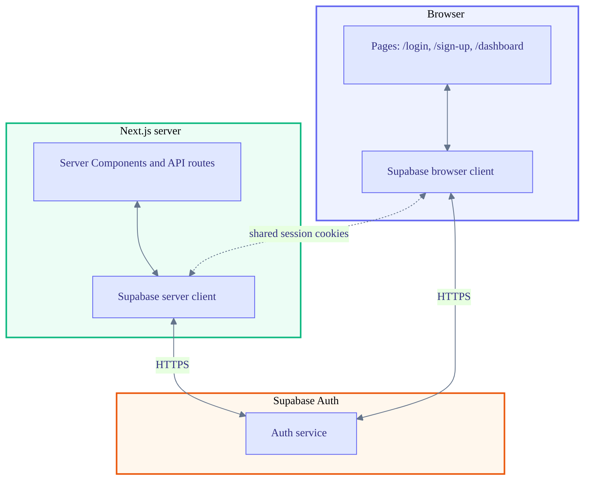
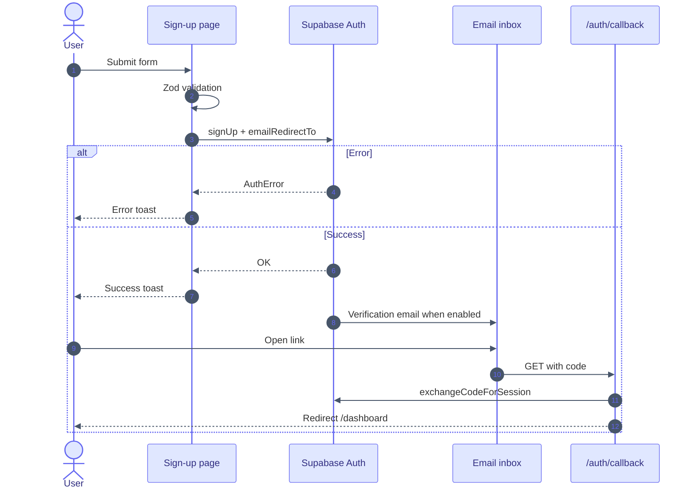
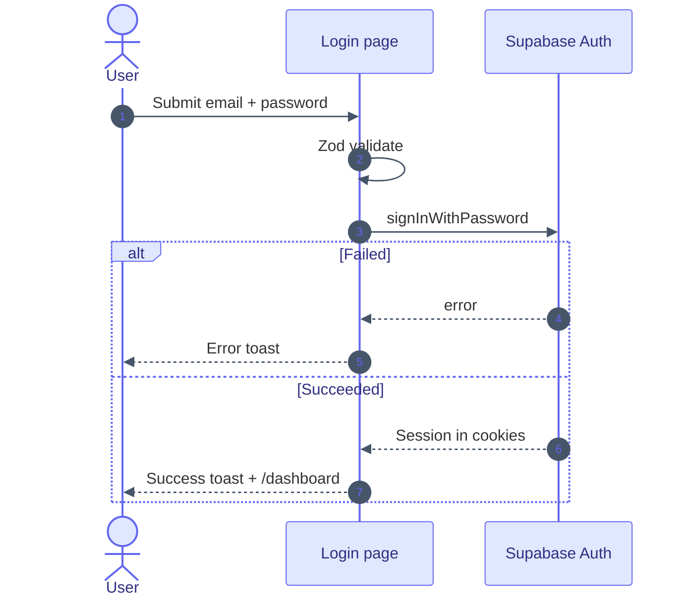
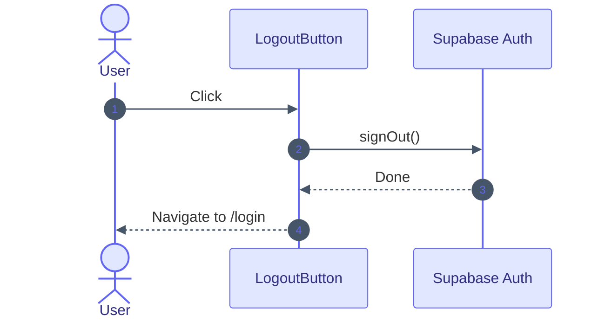

# User authentication

The user is able to **register**, **sign in**, and **sign out** using Supabase Auth, Next.js pages, and the `/auth/callback` route for email (and similar) exchanges. The session is stored in **cookies** that the browser Supabase client and the server client (`@supabase/ssr`) share, so API routes and Server Components see the same identity as the client.

Diagrams use [Mermaid](https://mermaid.js.org/).

---

## Implementation map

| Topic | Path |
|--------|------|
| Sign up | `apps/web/src/app/sign-up/page.tsx` |
| Log in | `apps/web/src/app/login/page.tsx` |
| Callback | `apps/web/src/app/auth/callback/route.ts` |
| Log out | `apps/web/src/components/logout-button.tsx` |
| Browser client | `apps/web/src/lib/supabase/client.ts` |
| Server client | `apps/web/src/lib/supabase/server.ts` |
| Auth error copy | `apps/web/src/lib/auth/supabase-errors.ts` |
| Auth context | `apps/web/src/app/layout.tsx`, `apps/web/src/features/auth/auth-context.tsx` |

---

## Environment variables

| Variable | Role |
|----------|------|
| `NEXT_PUBLIC_SUPABASE_URL` | Project URL (browser and server) |
| `NEXT_PUBLIC_SUPABASE_PUBLISHABLE_KEY` | Publishable key for both clients |

---

## Session over cookies

The dotted edge indicates that both clients read and write the **same cookie jar**, so one logical session applies across client and server.

---

## Registration

**Route:** `/sign-up`

The user is able to create an account by submitting **name**, **email**, and **password**. The form is validated with **Zod** on the client. The app calls `supabase.auth.signUp` with `emailRedirectTo` set to `{origin}/auth/callback` and `data: { full_name: name }`. Whether **email confirmation** is required before sign-in is configured in the Supabase dashboard, not in this repository.

After the user completes verification (when enabled), `GET /auth/callback` exchanges the code for a session and redirects to `/dashboard`. The root layout loads the current user on the server and passes membership into `AuthProvider`, which enables organization-scoped features (for example documents).

---

## Login

**Route:** `/login`

The user is able to sign in with **email** and **password** after **Zod** validation. The app calls `supabase.auth.signInWithPassword`. On success, a toast is shown and the browser navigates to **`/dashboard`** with a full page load so cookies are consistent for the next server render. The dashboard page calls `getUser()` and redirects to `/login` when there is no user. Helpers for middleware-style redirects live in `apps/web/src/proxy.ts` but are **not** imported from a root `middleware.ts` in the current tree.

---

## Logout

The user is able to sign out from the dashboard via **`LogoutButton`**. The component calls `supabase.auth.signOut()` and then navigates to **`/login`**.

---

## Quick reference

| Action | Where it happens |
|--------|------------------|
| Register | `/sign-up` → `signUp` |
| Confirm email | `GET /auth/callback` → `exchangeCodeForSession` → `/dashboard` |
| Log in | `/login` → `signInWithPassword` → `/dashboard` |
| Log out | `signOut` → `/login` |

---

## Supabase checklist

- **Site URL** and **Redirect URLs** include the app origin and `/auth/callback`.
- **Email confirmation** matches the intended UX (required vs optional).

---

## See also

- [Document management](document-management.md) — organization-scoped PDFs using the same session.
