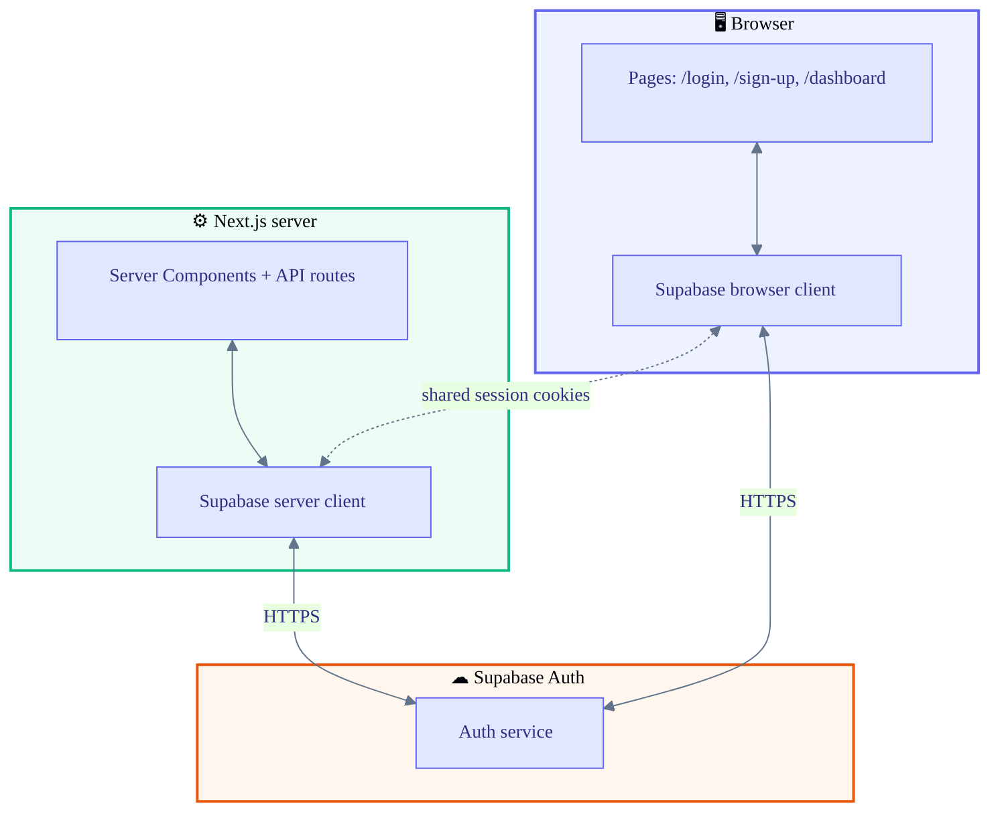
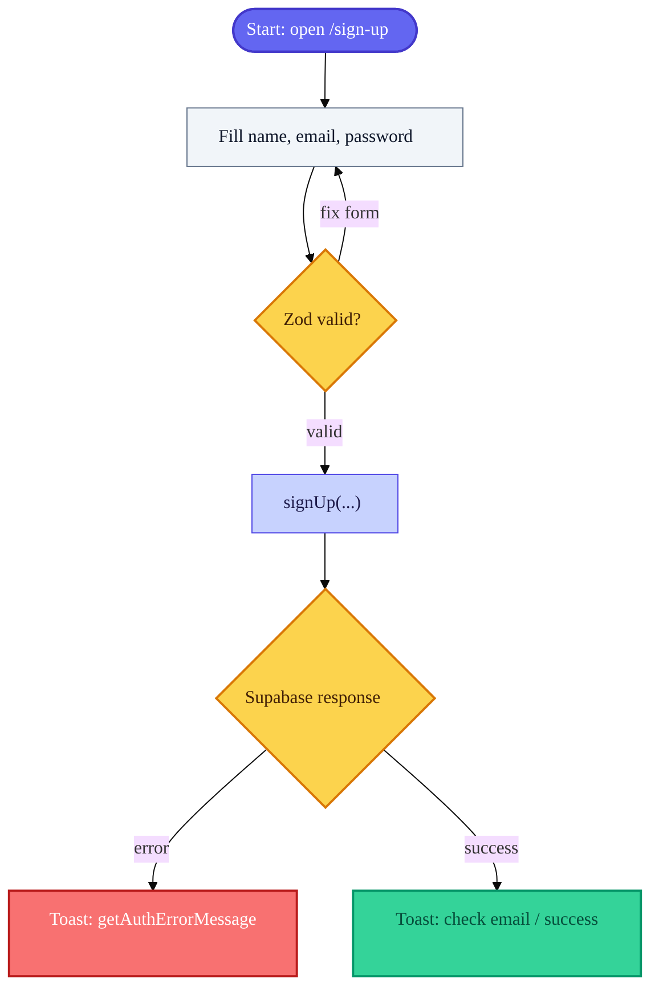
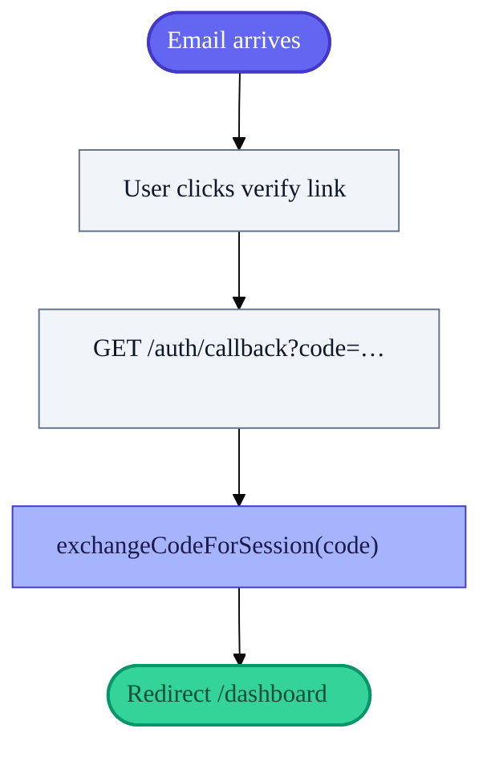
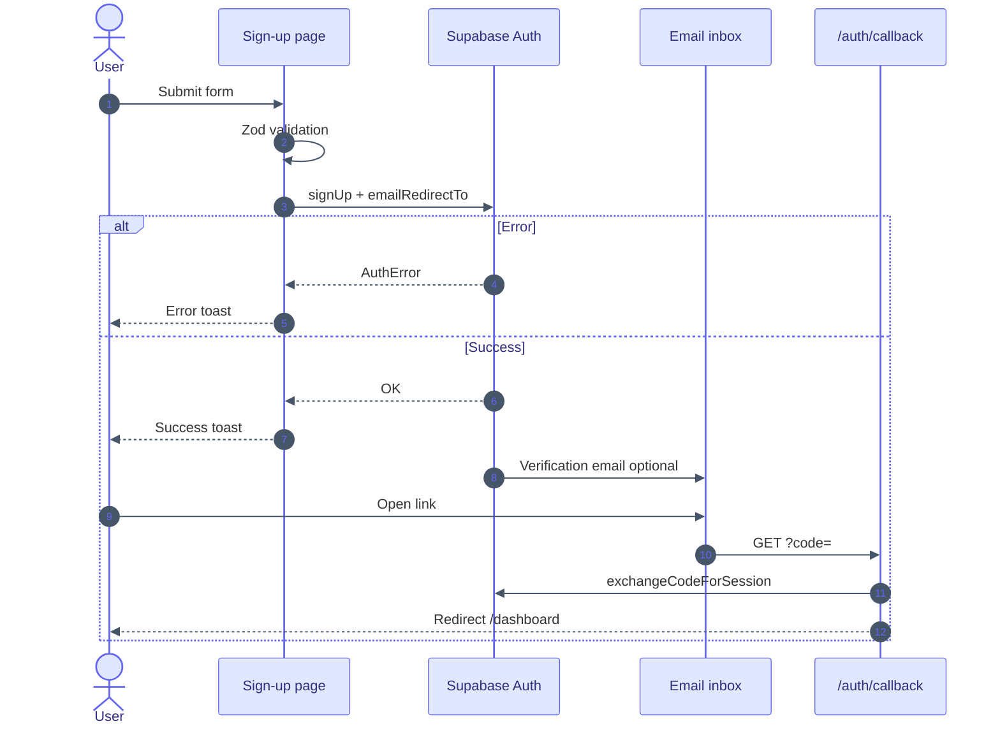
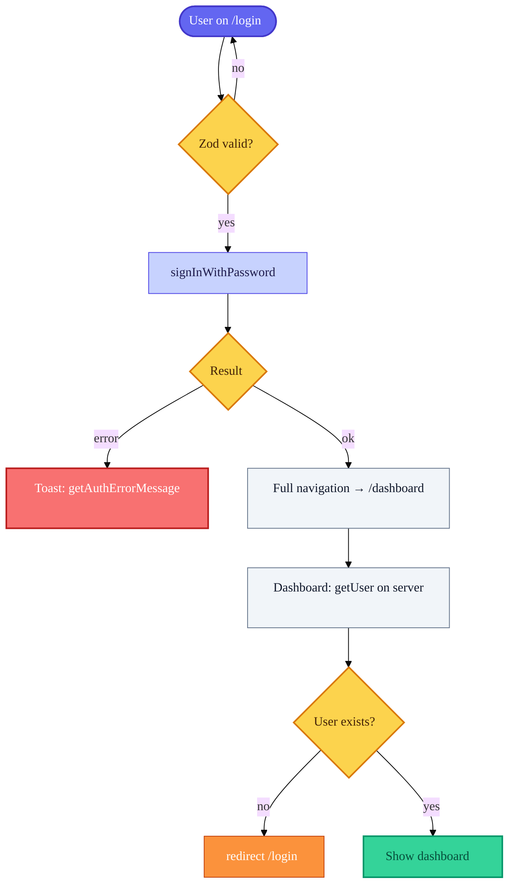
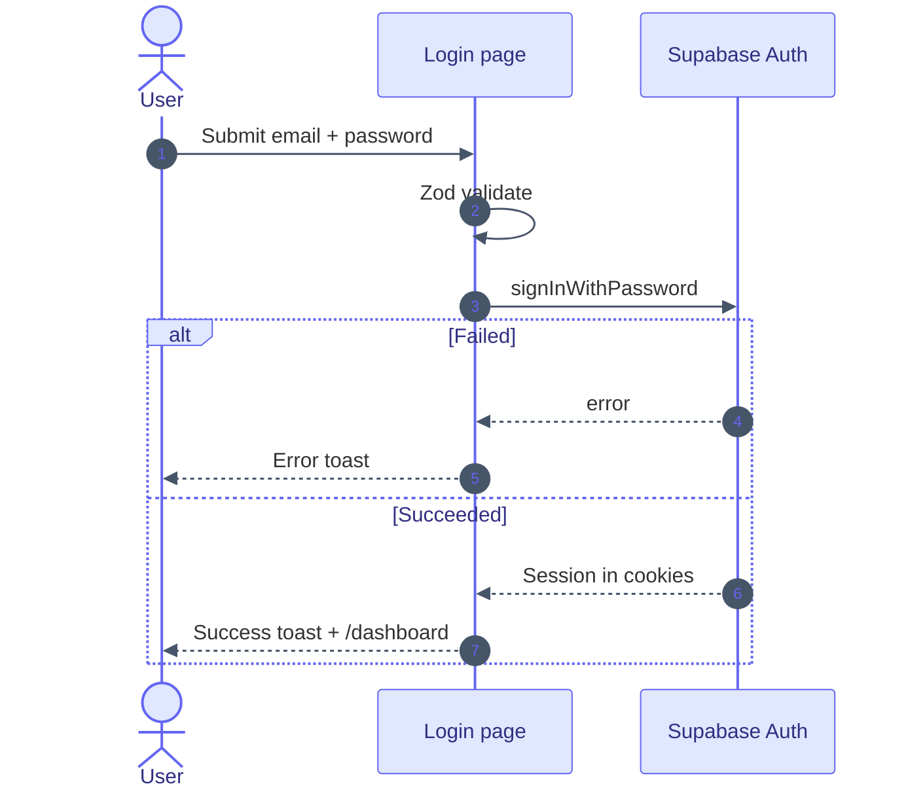
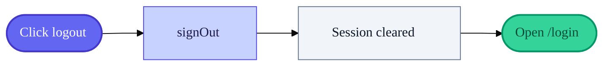
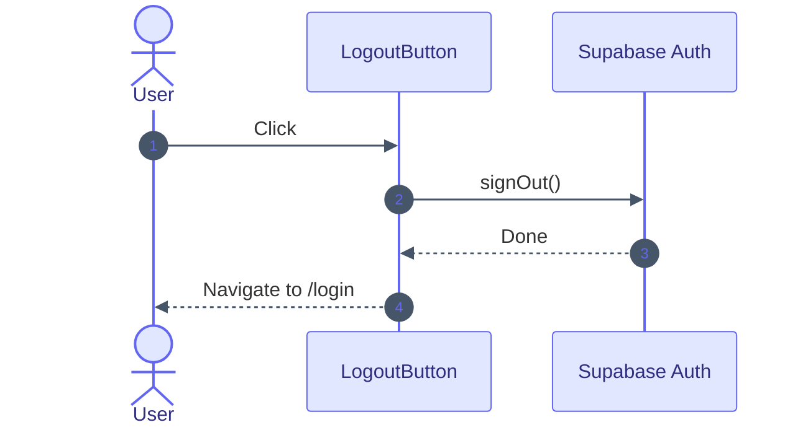

# User authentication

How **registration**, **login**, and **logout** work in this app: Supabase Auth, Next.js pages, and the email callback route.

Diagrams use [Mermaid](https://mermaid.js.org/). **Legend:** purple = start or entry, amber = decision, slate = processing step, green = success path, red = error path, indigo panels = system boundaries.

---

## Source files

| Topic | Path |
|--------|------|
| Sign up | `apps/web/src/app/sign-up/page.tsx` |
| Log in | `apps/web/src/app/login/page.tsx` |
| Email / OAuth callback | `apps/web/src/app/auth/callback/route.ts` |
| Log out | `apps/web/src/components/logout-button.tsx` |
| Browser Supabase client | `apps/web/src/lib/supabase/client.ts` |
| Server Supabase client (cookies) | `apps/web/src/lib/supabase/server.ts` |
| Friendly error messages | `apps/web/src/lib/auth/supabase-errors.ts` |
| Global auth state | `apps/web/src/app/layout.tsx`, `apps/web/src/features/auth/auth-context.tsx` |

---

## Environment variables

| Variable | Role |
|----------|------|
| `NEXT_PUBLIC_SUPABASE_URL` | Project URL (browser + server) |
| `NEXT_PUBLIC_SUPABASE_PUBLISHABLE_KEY` | Publishable key for both clients |

---

## How the session is shared

Supabase stores the session in **cookies**. The **browser** client and the **server** client (`@supabase/ssr`) read and update the same cookies, so Route Handlers and Server Components see the same user as the client.

The dotted line means: both clients rely on the **same cookie jar** so the session is one logical login.

---

## Registration (sign up)

**Route:** `/sign-up`

1. User enters **name**, **email**, **password**.
2. **Zod** validates on the client.
3. App calls `supabase.auth.signUp` with:
   - `emailRedirectTo: {origin}/auth/callback`
   - `data: { full_name: name }`

Whether the user **must confirm email** before signing in is set in the **Supabase dashboard** (Auth), not in this repo.

### Diagram A — What happens on the sign-up page

### Diagram B — After sign-up: email confirmation (when enabled)

### Sequence — Sign-up and callback (end to end)

### Session and org after login

The root layout loads the current user on the server and passes membership into `AuthProvider`. That powers org-scoped features (for example documents), not the auth forms themselves.

---

## Login

**Route:** `/login`

1. **Zod** validates email and password.
2. `supabase.auth.signInWithPassword({ email, password })`.
3. On success: success toast, then **`window.location.href = "/dashboard"`** (full page load so server and client agree on cookies).

### Diagram — Login flow

### Sequence — Login

### Middleware note

`apps/web/src/proxy.ts` contains logic suitable for **Next.js middleware** (for example redirecting logged-in users away from `/login`). **No `middleware.ts` imports it today.** The dashboard is protected by calling `getUser()` in the dashboard page and `redirect("/login")` if there is no user.

---

## Logout

**Component:** `LogoutButton` on the dashboard.

1. `supabase.auth.signOut()`
2. `window.location.href = "/login"`

---

## Quick reference

| Action | Where it happens |
|--------|-------------------|
| Register | Client: `/sign-up` → `signUp` |
| Confirm email | Server: `GET /auth/callback` → `exchangeCodeForSession` → redirect `/dashboard` |
| Log in | Client: `/login` → `signInWithPassword` → `/dashboard` |
| Log out | Client: `signOut` → `/login` |

---

## Supabase checklist (auth)

- Set **Site URL** and **Redirect URLs** to include your app origin and `/auth/callback`.
- Match **email confirmation** settings to the UX you want (required vs optional).

---

## See also

- [Document management](document-management.md) — org-scoped PDF list, upload, and open (uses the same session).
