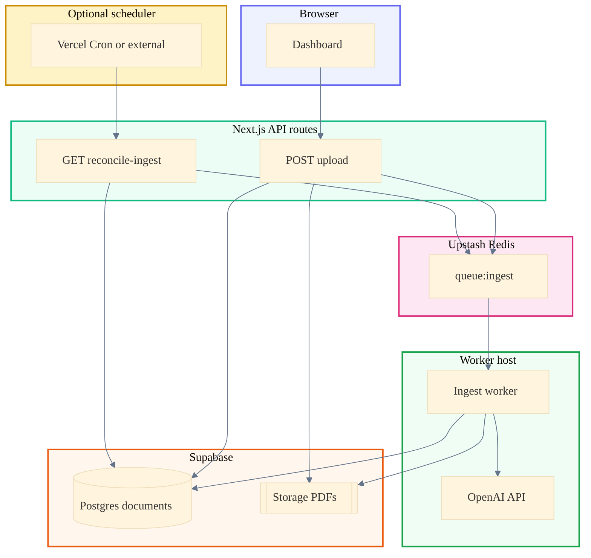

# Document ingest pipeline (reference)

This document describes the **planned** PDF ingest feature: queue-backed processing, worker, embeddings, and how the feature fits with the existing Next.js app and Supabase. Implementers may refer to it during development; the document should be kept aligned with the codebase.

Related material: [Document management](document-management.md) (current list/upload/open/delete), [Authentication](authentication.md) (session and org scoping).

---

## Goals

1. The HTTP response after upload does not block on PDF parsing or embeddings.
2. Work is handed off via **Upstash Redis** (list queue).
3. CPU-intensive and long-running steps run on a **worker** (Railway or Render).
4. Chunks and vectors persist in **`document_chunks`**; processing status persists on **`documents`**.
5. Queue delivery is treated as **at-least-once**; **database compare-and-set** makes duplicate messages safe.

---

## Architecture (high level)



**Paths**

- **Upload (primary):** the web app authenticates the user, uploads bytes to Storage, inserts a **`documents`** row, and **RPUSH**es a small JSON job to **`queue:ingest`**.
- **Reconcile (optional recovery):** a **cron** (or any scheduler) calls **`GET /api/cron/reconcile-ingest`** with **`CRON_SECRET`**. The handler reads **stale `pending`** rows in Postgres and **RPUSH**es again so work is not lost if the first enqueue failed after insert.
- **Worker:** consumes **`queue:ingest`** (e.g. `BRPOP` / `BLPOP`), loads the row by `documentId`, runs the pipeline, writes chunks and status, and calls **OpenAI** for embeddings (`OPENAI_API_KEY` stays on the worker only).

---

## Redis queue payload

After Storage upload and the database insert succeed, **one** message is enqueued (e.g. `RPUSH queue:ingest <json>`).

**Shape (JSON string):**

| Field | Type | Purpose |
|--------|------|---------|
| `documentId` | UUID string | Primary key in `public.documents`. |
| `correlationId` | UUID string | Same value as `documents.ingest_correlation_id` for log correlation. |
| `organizationId` | UUID string | Cross-check against the database row (optional defense in depth). |
| `enqueuedAt` | string | ISO-8601 instant with **`Z`** suffix (UTC on the wire), e.g. from `new Date().toISOString()` in Node. |

Secrets, full file content, and long paths should not be placed in the message when the worker can read **`storage_path`** from Postgres.

**Retries:** The upload route should apply about **three** attempts with backoff on transient failures when calling Upstash. If enqueue fails after the row exists, the document remains **`pending`** until a **reconciler** (cron or worker idle loop) re-enqueues.

---

## Worker processing (order of operations)

1. The message is popped from Redis (e.g. `BRPOP`, or `RPOPLPUSH` to a processing list for stronger crash semantics — see `.cursor/plans/` if that pattern is adopted).
2. JSON is parsed; required fields are validated.
3. A **compare-and-set** claim runs in Postgres:

   ```sql
   UPDATE documents
   SET processing_status = 'processing',
       processing_started_at = now()
   WHERE id = $documentId
     AND processing_status = 'pending';
   ```

   - **0 rows** updated → another worker claimed the row or the row is terminal → the message is acknowledged and processing stops (idempotent).
   - **1 row** updated → processing continues.

4. **`documents`** is selected by `id`; **`storage_path`** is verified to match `{organization_id}/{document_id}.pdf` (and the payload’s `organizationId` if present).
5. The PDF is downloaded from Storage (`documents` bucket) with the service role.
6. Text is extracted (e.g. `pdfjs-dist` / `unpdf`); page hints are attached in chunk **`metadata`** when possible.
7. Text is split into chunks (character windows + overlap for v1).
8. Embeddings are requested in batches from OpenAI (e.g. `text-embedding-3-small`, dimension **1536** — must match `vector(1536)`).
9. In a **single transaction:** `DELETE FROM document_chunks WHERE document_id = …`; chunks are bulk-inserted; `documents` is updated to `processing_status = 'ready'`, `processed_at = now()`, `processing_error = null`.
10. On hard failure: `documents` is set to `processing_status = 'failed'` with a truncated `processing_error`; optionally the message moves to a **DLQ** in Redis after N attempts.

**Logging:** Structured JSON is emitted per step with `correlationId`, `documentId`, `stage`, and `durationMs`.

---

## Database (target deltas)

Baseline tables: `organizations`, `memberships`, `profiles`, `documents`, `document_chunks` (per the Supabase schema in use).

### `documents` (additions)

| Column | Type | Notes |
|--------|------|--------|
| `processing_status` | `text` NOT NULL DEFAULT `'pending'` | `CHECK` in `pending`, `processing`, `ready`, `failed` |
| `processing_error` | `text` | Nullable |
| `processed_at` | `timestamp without time zone` | Nullable; **value is always UTC** (see [Time convention](#time-convention-backend-utc-without-time-zone)) |
| `processing_started_at` | `timestamp without time zone` | Nullable; **UTC** |
| `ingest_correlation_id` | `uuid` | Nullable |

### `document_chunks` (hardening)

- `document_id` is **NOT NULL** with **`ON DELETE CASCADE`** to `documents`.
- `chunk_index` **int NOT NULL** (0-based order).
- `metadata` **jsonb** NOT NULL DEFAULT `'{}'`.
- `embedding` as **`vector(1536)`** (or the chosen model dimension).
- The **`pgvector`** extension is enabled.

### Optional

- A **`queue:ingest:dlq`** key for poison messages.
- A **`document_jobs`** table is not required if Redis plus `documents.processing_*` are sufficient.

---

## API routes (Next.js) — responsibilities

| Route | Role in pipeline |
|--------|-------------------|
| `POST /api/documents/upload` | Authentication, org resolution, Storage upload, insert into `documents` (**pending**), generation of `correlationId`, **Redis enqueue** (with retries). |
| `GET /api/documents` | The `select` list includes `processing_status`, `processing_error`, and `processed_at` for UI badges. |
| `DELETE /api/documents/:id` | Behavior matches the current flow; chunks are removed via **`ON DELETE CASCADE`** after migration. |
| `GET /api/documents/:id/open` | Unchanged. |
| Optional `GET /api/cron/reconcile-ingest` | See [Reconcile cron job](#reconcile-cron-job-optional) below. |

Relevant paths: `apps/web/src/app/api/documents/**`; an enqueue helper belongs under `apps/web/src/lib/queue/`.

---

## Reconcile cron job (optional)

### Purpose

The normal path is: **upload** → insert into **`documents`** (status **`pending`**) → **RPUSH** to `queue:ingest` (with retries). If the database insert succeeds but **every enqueue attempt fails** (transient Upstash error, misconfiguration, etc.), the row remains **`pending`** and **no job exists in Redis**, so the worker never sees it.

The **reconcile** flow fixes that gap: a scheduled or manual **`GET /api/cron/reconcile-ingest`** selects **`pending`** rows older than a threshold (**`minAgeMinutes`**, default **5**) and **RPUSH**es the same payload shape again. A short **Redis lock** per `documentId` reduces duplicate messages when several schedulers overlap.

### What it is not

- **Not required** for the happy path when upload enqueue succeeds.
- **Not** a substitute for the worker; it only **refills the queue** for stuck rows.
- **Vercel Cron** (via [`apps/web/vercel.json`](../apps/web/vercel.json)) is one way to call the route on a schedule (**once per day at 00:00 UTC**); it is optional if the app is hosted elsewhere or cron is not used yet. Change the `schedule` expression in `vercel.json` to adjust timing.

### How it is secured and configured

- **Authentication:** `Authorization: Bearer <CRON_SECRET>`. Set **`CRON_SECRET`** in the deployment environment (Vercel project env, etc.).
- **Also required on the server:** **`SUPABASE_SERVICE_ROLE_KEY`** (service-role query across orgs) and **Upstash** env vars so locks and **RPUSH** work.
- **Query:** `GET /api/cron/reconcile-ingest?minAgeMinutes=5` — only rows with **`created_at`** before the cutoff are considered.

### Alternatives to Vercel Cron

Any scheduler that issues an HTTP **GET** with the bearer secret (Railway cron, Render cron, GitHub Actions, external uptime monitors, manual **`curl`**) can replace Vercel’s cron. The route implementation does not depend on Vercel-specific headers.

---

## Frontend (dashboard)

The document type is extended with **`processing_status`** (and optional error text). The list query uses **`refetchInterval`** while any row is `pending` or `processing`. Badges reflect state; a subtle message appears for `failed`.

Implementation file: `apps/web/src/app/dashboard/dashboard-documents.tsx`.

---

## Redis queue — implementation

| Role | Location | Mechanism |
|------|----------|-----------|
| Key names | [`apps/web/src/lib/queue/redis-keys.ts`](../apps/web/src/lib/queue/redis-keys.ts) | `queue:ingest` (main FIFO list), `queue:ingest:dlq` (dead letters), `reconcile:lock:*` (cron dedup; see enqueue module). |
| Producer (Next.js) | [`enqueue-document-ingest.ts`](../apps/web/src/lib/queue/enqueue-document-ingest.ts) | `@upstash/redis` REST **`RPUSH`** to the **tail** of `queue:ingest`. |
| DLQ from API | Same file, `pushIngestToDlq` | **`LPUSH`** JSON (`rawMessage`, `reason`, `at`) to `queue:ingest:dlq` for tooling or future admin paths. |
| Consumer (worker) | [`apps/document-worker`](../apps/document-worker/) | **`ioredis`** over **`UPSTASH_REDIS_URL`** (`rediss://`); **`BLPOP queue:ingest 0`** on the **head** → **FIFO** with the producer. Malformed payloads or unhandled **`onJob`** errors are **LPUSH**ed to the DLQ. |
| Part 5 pipeline | Same package: [`processor/run-document-ingest.ts`](../apps/document-worker/src/processor/run-document-ingest.ts), [`db/claim-and-finalize.ts`](../apps/document-worker/src/db/claim-and-finalize.ts), [`embed/openai.ts`](../apps/document-worker/src/embed/openai.ts) | **CAS** `pending`→`processing`; Storage download; **`unpdf`** extract; chunk + overlap; OpenAI **`text-embedding-3-small`** (dim **1536**); RPC **`worker_finalize_document_ingest`** (transaction: replace chunks, `ready`). Failures call **`worker_fail_document_processing`**. |

Run locally: `pnpm --filter document-worker dev` from the repo root. SQL: [`supabase/migrations/20260329120000_document_ingest_pipeline.sql`](../supabase/migrations/20260329120000_document_ingest_pipeline.sql).

---

## Environment variables

### Next.js (server-only where noted)

| Variable | Purpose |
|----------|---------|
| `NEXT_PUBLIC_SUPABASE_URL` | Supabase project URL |
| `NEXT_PUBLIC_SUPABASE_PUBLISHABLE_KEY` | User-scoped client |
| `SUPABASE_SERVICE_ROLE_KEY` | Optional; Storage and database when the user JWT is insufficient |
| `UPSTASH_REDIS_REST_URL` | Redis REST (enqueue from serverless) |
| `UPSTASH_REDIS_REST_TOKEN` | Must not use the `NEXT_PUBLIC_` prefix |
| `CRON_SECRET` | Optional; bearer token for `GET /api/cron/reconcile-ingest` (see [Reconcile cron job](#reconcile-cron-job-optional)) |

`OPENAI_API_KEY` is not set on the web tier when only the worker performs embedding calls.

### Worker (Railway / Render)

| Variable | Purpose |
|----------|---------|
| `UPSTASH_REDIS_URL` | **Required.** Redis protocol URL from Upstash (`rediss://…`), not the REST URL. |
| `SUPABASE_URL` | **Required.** Same project URL as the web app. |
| `SUPABASE_SERVICE_ROLE_KEY` | **Required.** Storage download + RPC finalize/fail. |
| `OPENAI_API_KEY` | **Required.** Embeddings on the worker only. |
| `WORKER_CONCURRENCY`, `MAX_PDF_BYTES`, `MAX_CHUNKS_PER_DOCUMENT`, `CHUNK_SIZE`, `CHUNK_OVERLAP`, `EMBEDDING_MODEL`, `EMBEDDING_DIMENSIONS` | Optional guardrails (see worker `README.md`; DB uses **`vector(1536)`** today). |
| `TZ=UTC` | Recommended so Node and Postgres session defaults interpret `now()` as UTC when writing **`timestamp without time zone`** (see below) |

---

## Deployment (short)

1. **Upstash:** A Redis database is created; REST credentials are configured on the Next.js host; the Redis protocol URL is configured on the worker.
2. **Next.js host:** `apps/web` is deployed with Supabase and Upstash variables.
3. **Worker:** `apps/document-worker` (or the monorepo subpath) is deployed with worker variables; an **always-on** service keeps dequeue latency low.

---

## Time convention (backend: UTC without time zone)

### Policy

The backend standardizes on **PostgreSQL `timestamp without time zone`** for stored instants. Columns do **not** store a timezone offset; **every value is written and read as UTC** by project convention.

- The Supabase **database `TimeZone`** (and Node **`TZ`**) should be **`UTC`** so `now()`, defaults, and drivers do not shift wall-clock values into another zone before storage.
- JSON payloads on the wire (e.g. `enqueuedAt`) use **ISO-8601 with `Z`** from `new Date().toISOString()` in JavaScript, which denotes UTC for interchange.
- **`timestamptz`** is **not** used for these columns so that the database type matches the “UTC-only, no offset column” rule; correctness depends on **always** running writers in UTC context (`TimeZone = UTC`, `TZ=UTC`).

### Review of current backend (`apps/web` API routes)

| Area | Finding |
|------|---------|
| `api/documents/*.ts` | No manual `Date` construction or timezone APIs. Handlers rely on Postgres defaults and Supabase responses. |
| `auth/callback/route.ts` | No timestamp logic. |
| Alignment | Existing `documents.created_at` is already modeled as **`timestamp without time zone`** in the reference schema; new columns follow the same type and UTC semantics. |

### Recommended actions

1. Supabase **Database → Settings:** **`TimeZone`** is set to **`UTC`**.
2. Migrations add `processed_at` and `processing_started_at` as **`timestamp without time zone`** (nullable). `DEFAULT now()` is acceptable when the session timezone is UTC.
3. When enqueue is implemented, `enqueuedAt` is set with **`new Date().toISOString()`** (UTC with `Z` on the wire).
4. The worker process on Railway / Render sets **`TZ=UTC`**.
5. The dashboard may call `toLocaleString()` without options so the **end user’s locale and local zone** apply to display; that does not change the UTC convention in the database. For on-screen UTC labels, `toLocaleString` with `timeZone: 'UTC'` or the raw ISO string may be used.

### Optional helper

A small server-only helper may centralize wire-format instants:

```ts
/** UTC instant as ISO-8601 with Z — suitable for JSON payloads and logs. */
export function utcIsoNow(): string {
  return new Date().toISOString();
}
```

A typical location is `apps/web/src/lib/datetime.ts`; the upload route may import it when enqueueing.

---

## Supabase SQL Editor (schema changes)

The following statements may be run in the **Supabase Dashboard → SQL Editor**. A backup or branch database is recommended before altering production. The project convention uses **`timestamp without time zone`** for instants, with **UTC** semantics; the database **`TimeZone`** should be set to **`UTC`** under **Project Settings → Database** (not only in SQL).

### 1. Extension (pgvector)

```sql
CREATE EXTENSION IF NOT EXISTS vector;
```

### 2. Table `public.documents` — ingest columns

```sql
ALTER TABLE public.documents
  ADD COLUMN IF NOT EXISTS processing_status text NOT NULL DEFAULT 'pending',
  ADD COLUMN IF NOT EXISTS processing_error text,
  ADD COLUMN IF NOT EXISTS processed_at timestamp without time zone,
  ADD COLUMN IF NOT EXISTS processing_started_at timestamp without time zone,
  ADD COLUMN IF NOT EXISTS ingest_correlation_id uuid;

ALTER TABLE public.documents
  DROP CONSTRAINT IF EXISTS documents_processing_status_check;

ALTER TABLE public.documents
  ADD CONSTRAINT documents_processing_status_check
  CHECK (processing_status IN ('pending', 'processing', 'ready', 'failed'));
```

If `processing_status` already existed without the check, the `DROP CONSTRAINT` line removes the old name only when that name was used; rename the constraint in `DROP` if the project uses a different identifier.

### 3. Table `public.document_chunks` — foreign key, columns, embedding type

**3a. Foreign key with `ON DELETE CASCADE`**

The existing FK name in the database may differ; inspect **Table editor → document_chunks → Constraints** if `DROP CONSTRAINT` fails.

```sql
ALTER TABLE public.document_chunks
  DROP CONSTRAINT IF EXISTS document_chunks_document_id_fkey;

ALTER TABLE public.document_chunks
  ADD CONSTRAINT document_chunks_document_id_fkey
  FOREIGN KEY (document_id) REFERENCES public.documents (id) ON DELETE CASCADE;
```

**3b. `document_id` NOT NULL**

This fails if any row has `document_id IS NULL`; those rows must be fixed or deleted first.

```sql
ALTER TABLE public.document_chunks
  ALTER COLUMN document_id SET NOT NULL;
```

**3c. `chunk_index` and `metadata`**

```sql
ALTER TABLE public.document_chunks
  ADD COLUMN IF NOT EXISTS chunk_index integer NOT NULL DEFAULT 0,
  ADD COLUMN IF NOT EXISTS metadata jsonb NOT NULL DEFAULT '{}'::jsonb;
```

After backfilling real `chunk_index` values (if the table already had rows), the default on `chunk_index` may be dropped if desired:

```sql
ALTER TABLE public.document_chunks
  ALTER COLUMN chunk_index DROP DEFAULT;
```

**3d. Column `embedding` as `vector(1536)`**

The correct approach depends on the current type and whether the table contains data.

- **Empty table or disposable data:** the column may be replaced cleanly:

```sql
ALTER TABLE public.document_chunks DROP COLUMN IF EXISTS embedding;

ALTER TABLE public.document_chunks
  ADD COLUMN embedding vector(1536);
```

- **Existing `vector` with another dimension:** adjust `1536` and use `ALTER COLUMN ... TYPE vector(1536)` with an appropriate `USING` clause per pgvector docs.

- **Non-vector legacy type:** plan a one-off migration or recreate the column; the worker and application must agree on **one** embedding model and dimension (**1536** matches `text-embedding-3-small` with default dimensions).

### 4. Optional index (reconciler / dashboards)

```sql
CREATE INDEX IF NOT EXISTS idx_documents_processing_status
  ON public.documents (processing_status);
```

### 5. Row Level Security on `document_chunks` (optional but typical)

If RLS is enabled on other public tables, enable it for chunks and allow **SELECT** only when the parent document belongs to the caller’s organization (same idea as listing `documents`).

```sql
ALTER TABLE public.document_chunks ENABLE ROW LEVEL SECURITY;
```

Example policy for **read** access (authenticated users; adjust names if `memberships` or columns differ):

```sql
DROP POLICY IF EXISTS "document_chunks_select_org" ON public.document_chunks;

CREATE POLICY "document_chunks_select_org"
  ON public.document_chunks
  FOR SELECT
  TO authenticated
  USING (
    EXISTS (
      SELECT 1
      FROM public.documents AS d
      INNER JOIN public.memberships AS m
        ON m.organization_id = d.organization_id
      WHERE d.id = document_chunks.document_id
        AND m.user_id = (SELECT auth.uid())
    )
  );
```

Inserts and updates for chunks are expected from the **service role** (worker), which bypasses RLS when the service key is used. End users should not receive policies that insert into `document_chunks` unless that is an explicit product requirement.

### 6. Verification queries

```sql
SELECT column_name, data_type, is_nullable
FROM information_schema.columns
WHERE table_schema = 'public'
  AND table_name = 'documents'
  AND column_name IN (
    'processing_status', 'processing_error', 'processed_at',
    'processing_started_at', 'ingest_correlation_id'
  );

SELECT column_name, data_type, udt_name
FROM information_schema.columns
WHERE table_schema = 'public'
  AND table_name = 'document_chunks';
```

---

## Implementation checklist

- [ ] Supabase migrations: `documents` processing columns (`timestamp without time zone`, UTC convention), `document_chunks` + `vector`, RLS for chunks — see [`supabase/migrations/20260329120000_document_ingest_pipeline.sql`](../supabase/migrations/20260329120000_document_ingest_pipeline.sql).
- [x] `enqueue-document-ingest.ts` and dependency `@upstash/redis`.
- [x] Upload route: insert fields, enqueue, correlation id.
- [x] List route: extended `select`.
- [x] Worker package: Redis **BLPOP**, CAS claim, extract/chunk/embed, RPC transactional writes (`worker_finalize_document_ingest` / `worker_fail_document_processing`).
- [x] Dashboard: status and polling.
- [x] Optional: reconcile cron and DLQ (Redis + route).
- [x] [document-management.md](document-management.md) API fields for processing status.

---

## See also

- [Document management](document-management.md)
- [Authentication](authentication.md)
