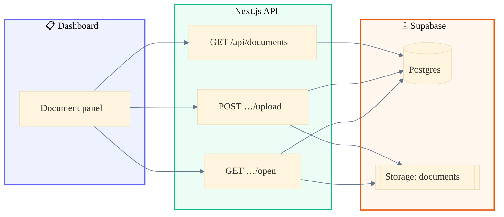
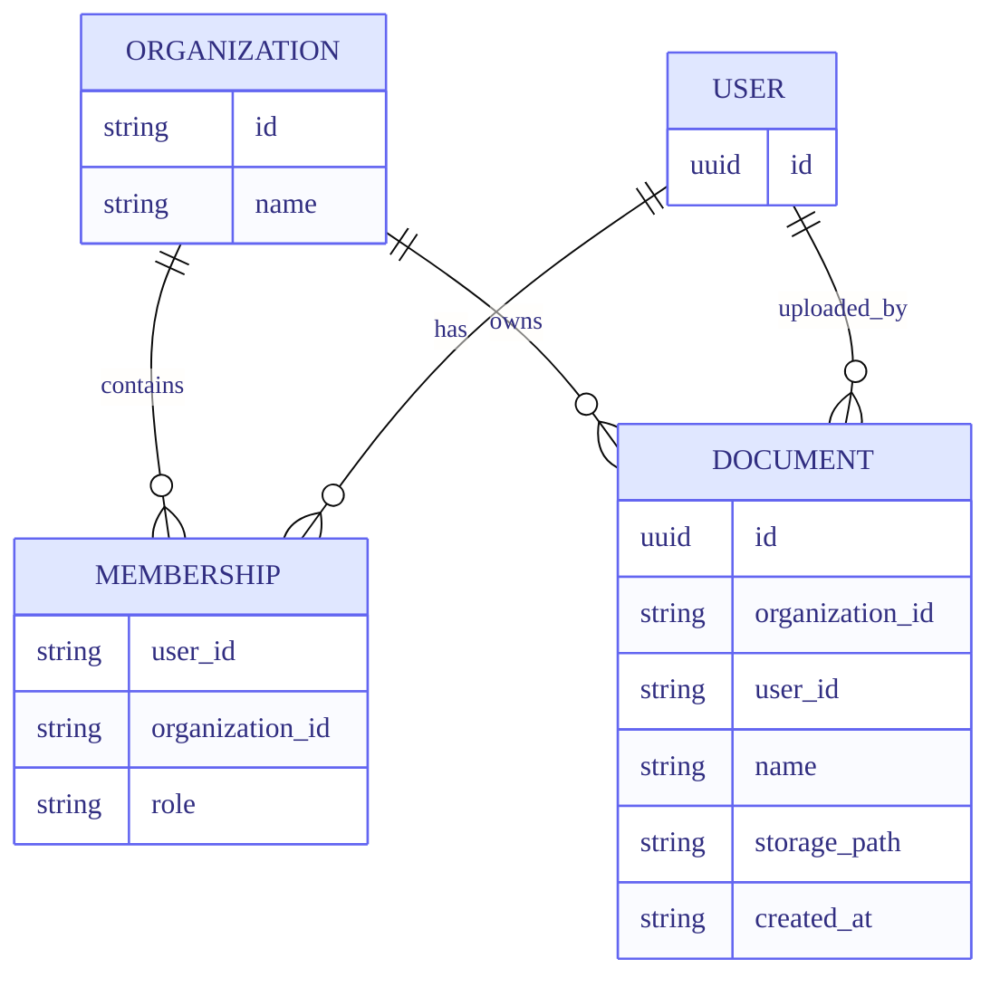
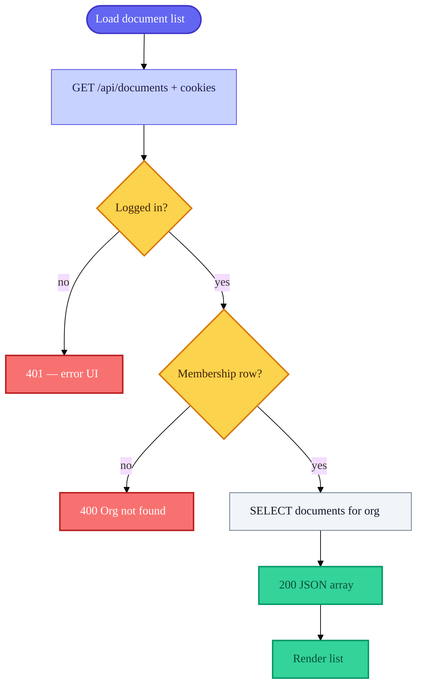
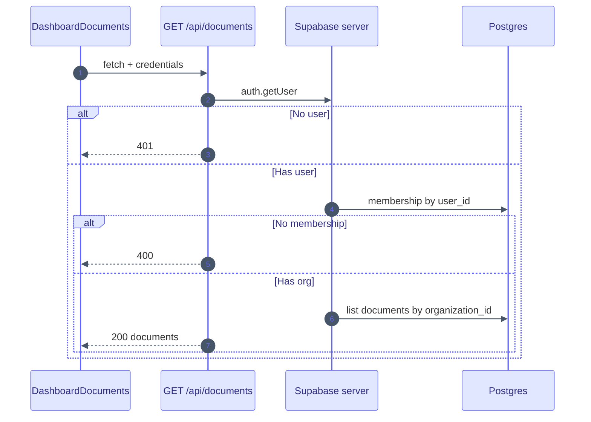
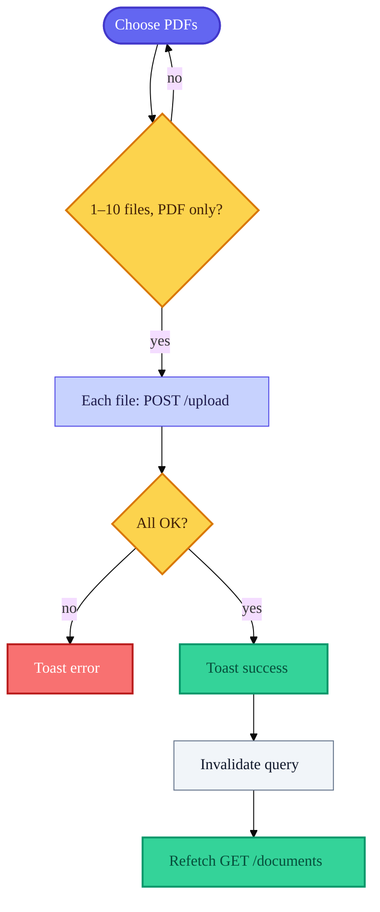
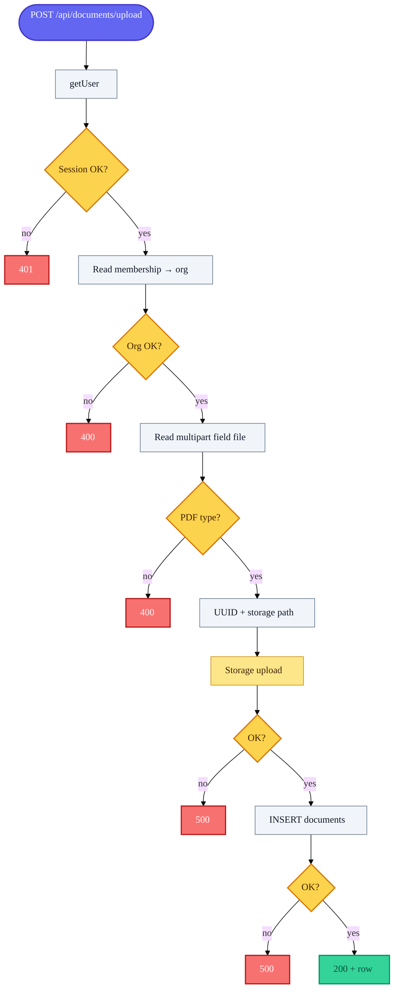
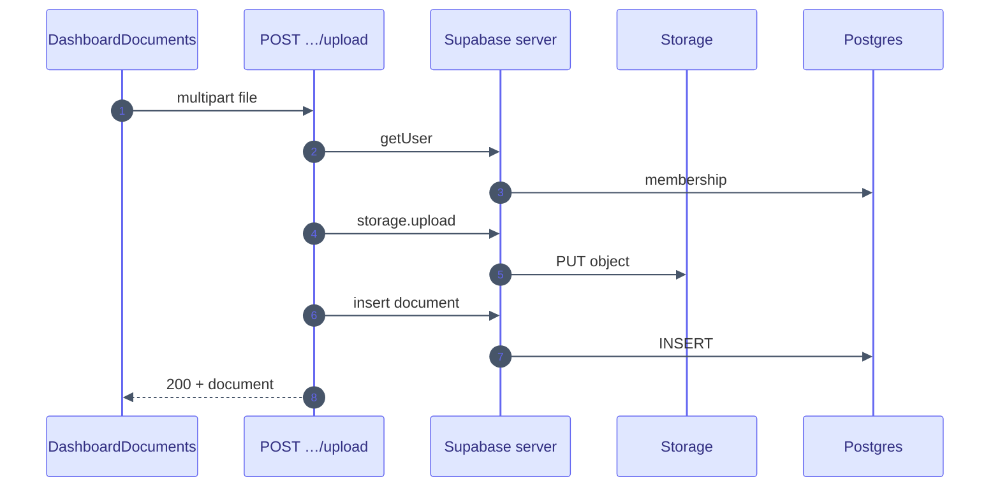
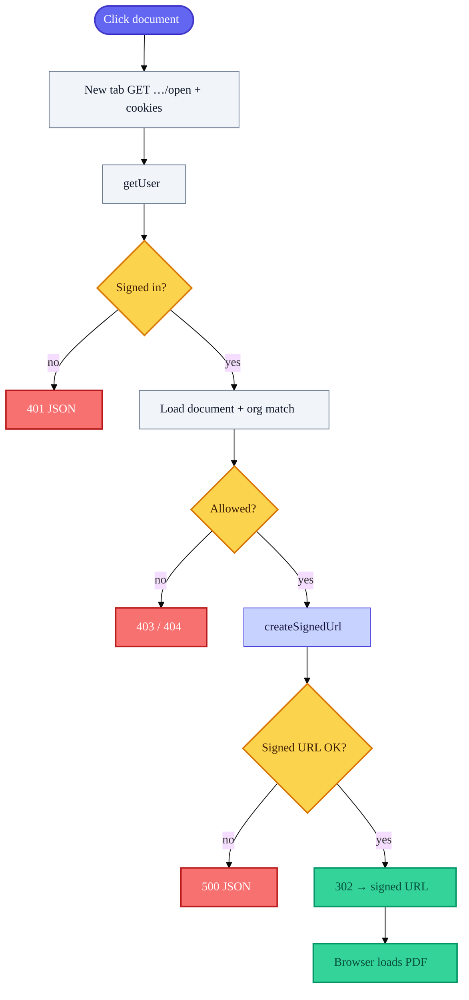
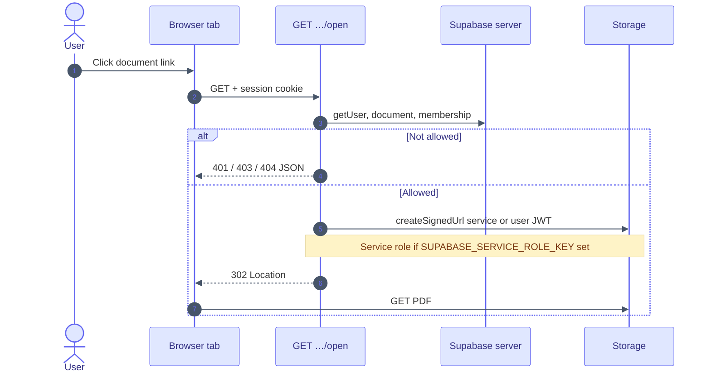

# Document management

How **PDF documents** are **listed**, **uploaded**, and **opened** in this app: dashboard UI, Next.js API routes, Supabase Postgres, and Supabase Storage.

Diagrams use [Mermaid](https://mermaid.js.org/). **Legend:** purple = entry, amber = decision, slate = step, indigo = API / Supabase call, green = success, red = error; panels show system boundaries.

---

## Source files

| Topic | Path |
|--------|------|
| List + upload UI | `apps/web/src/app/dashboard/dashboard-documents.tsx` |
| React Query setup | `apps/web/src/components/react-query-provider.tsx` |
| List API | `apps/web/src/app/api/documents/route.ts` |
| Upload API | `apps/web/src/app/api/documents/upload/route.ts` |
| Open / signed URL | `apps/web/src/app/api/documents/[documentId]/open/route.ts` |
| Service role (signing) | `apps/web/src/lib/supabase/service-role.ts` |
| Server Supabase | `apps/web/src/lib/supabase/server.ts` |

---

## Environment variables

| Variable | Role |
|----------|------|
| `NEXT_PUBLIC_SUPABASE_URL` | Project URL |
| `NEXT_PUBLIC_SUPABASE_PUBLISHABLE_KEY` | User-scoped server + client access |
| `SUPABASE_SERVICE_ROLE_KEY` | **Server only.** Optional; used to create **signed URLs** for Storage when the user JWT cannot sign (see [Open a document](#open-a-document-view)). |

---

## Big picture

Every document API route:

1. Identifies the user from the **session cookie**.
2. Loads **`memberships`** to get **`organization_id`**.
3. Only reads or writes data for that organization.

---

## Data model (conceptual)

Users come from **Supabase Auth**. This diagram shows app tables and how they relate. Exact keys and RLS live in your Supabase project.

Rows in **USER** correspond to Supabase **`auth.users`** (not an app-owned table in this diagram).

**Storage path pattern:** `{organization_id}/{document_uuid}.pdf`

---

## List documents

**UI:** TanStack Query `useQuery` with key `["documents"]`.

**Request:** `GET /api/documents` with `credentials: "include"`.

**Server:** `getUser()` → load **one** `memberships` row for that user → `select` from **`documents`** where `organization_id` matches, ordered by `created_at` descending.

### Decision flow

### Sequence

**Success body:** `{ documents: [{ id, name, storage_path, user_id, organization_id, created_at }, ...] }`

---

## Upload documents

**UI rules:** 1–10 files, **PDF only** (`application/pdf`), validated with Zod.

**Important:** The UI sends **one file per HTTP request**. Each selected file triggers a separate `POST /api/documents/upload`.

**Form field name:** `file` (multipart).

### What the user sees

### What the server does (one upload)

### Sequence (single file)

**Success body:** `{ success: true, document: { ... } }`

### Remove button in the UI

The **X** control **only removes the row from React Query cache** and shows a toast. It does **not** call an API: **Storage and the database are unchanged** until you add a delete endpoint.

---

## Open a document (view)

**UI:** Link to `/api/documents/{id}/open` with `target="_blank"`.

**Server:**

1. Ensure user is logged in.
2. Ensure a **`documents`** row exists and its `organization_id` matches the user’s membership (otherwise **403** or **404**).
3. Call **`createSignedUrl`** on bucket `documents` for `storage_path` (TTL **3600** seconds in code).
4. Respond with **HTTP 302** to the signed URL. The browser loads the PDF from Supabase, not through your Node process.

### Access check + redirect

### Sequence

### Why `SUPABASE_SERVICE_ROLE_KEY` exists

Storage **RLS** can block `createSignedUrl` for the normal user JWT even when your app has already verified org access. The open route prefers a **service role** client when the env var is set, **after** application-level checks, so signing succeeds. **Never expose this key to the browser.**

---

## API quick reference

| Action | HTTP | Notes |
|--------|------|--------|
| List | `GET /api/documents` | Cookie session |
| Upload | `POST /api/documents/upload` | `multipart/form-data`, field **`file`**, one PDF per request |
| Open | `GET /api/documents/:documentId/open` | **302** to signed Storage URL |

---

## Supabase checklist (documents)

- **Tables:** `memberships`, `organizations`, `documents` (and policies that match how the API queries them).
- **Storage:** Bucket named **`documents`**.
- **Server secrets:** `SUPABASE_SERVICE_ROLE_KEY` only in server env (for example `apps/web` for Route Handlers).

---

## See also

- [User authentication](authentication.md) — how the session cookie is established (required for all document APIs).
