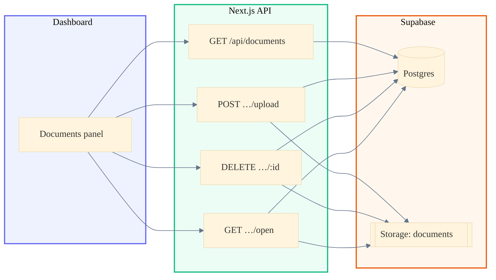
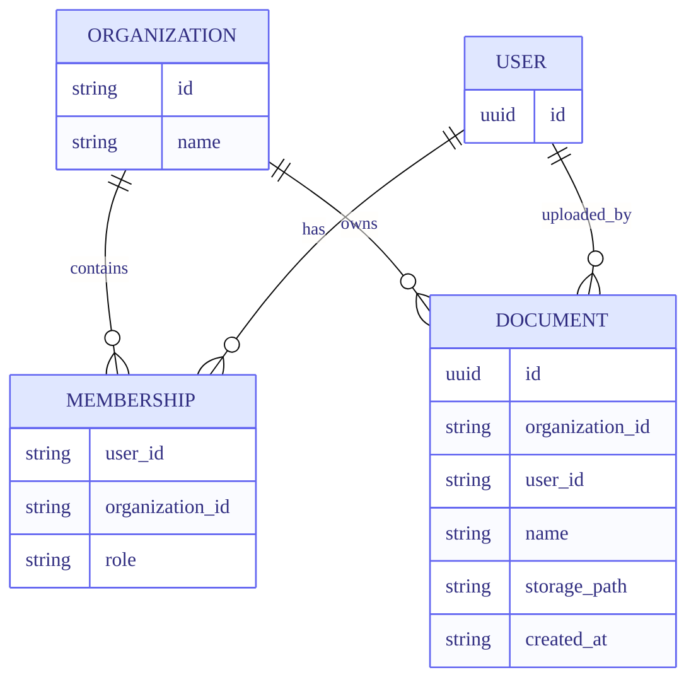
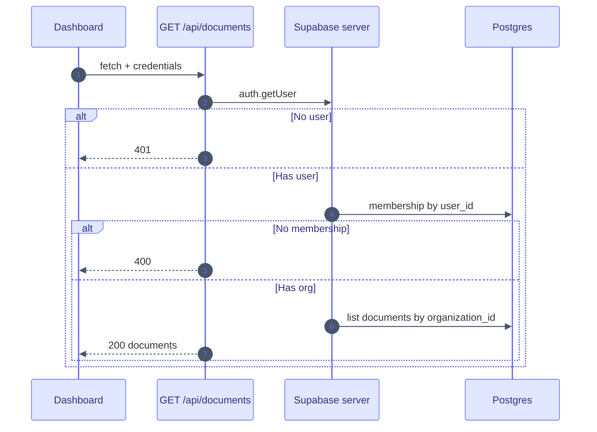
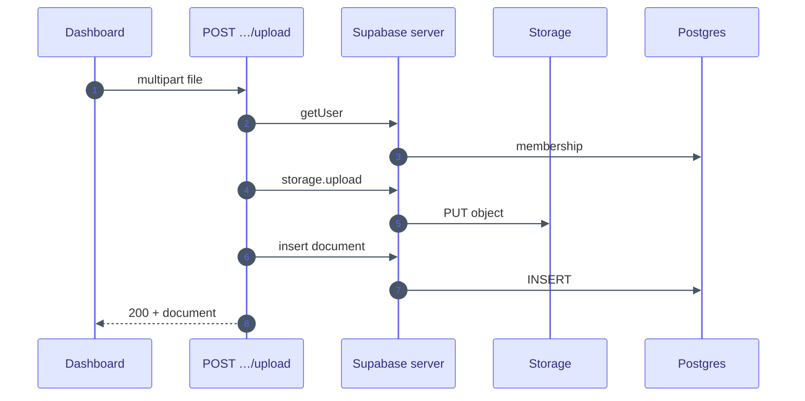
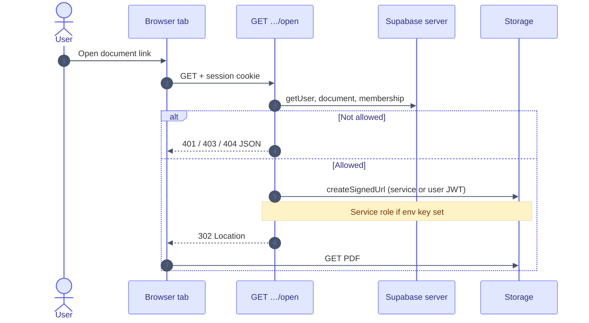
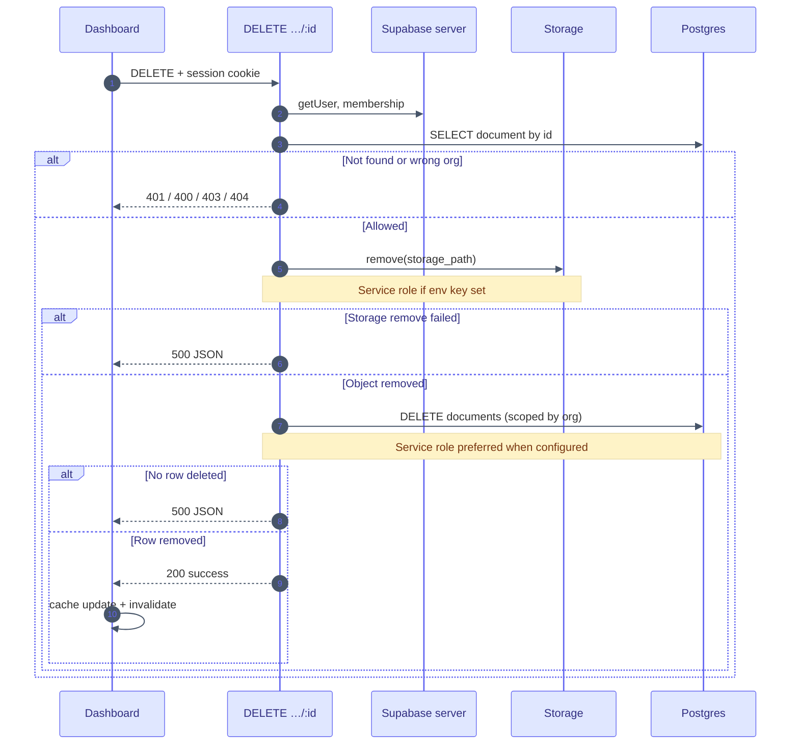

# Document management

An authenticated user is able to **list**, **upload**, **open**, and **delete** PDFs scoped to their organization. Next.js route handlers read the session cookie, resolve `organization_id` from `memberships`, and touch only that org’s rows and Storage objects. File bytes live in the Supabase Storage bucket **`documents`**; metadata lives in **`documents`** in Postgres.

Diagrams use [Mermaid](https://mermaid.js.org/).

---

## Implementation map

| Topic | Path |
|--------|------|
| Dashboard UI | `apps/web/src/app/dashboard/dashboard-documents.tsx` |
| Document list types | `apps/web/src/types/document.ts` |
| List | `apps/web/src/app/api/documents/route.ts` |
| Upload | `apps/web/src/app/api/documents/upload/route.ts` |
| Delete | `apps/web/src/app/api/documents/[documentId]/route.ts` |
| Open (signed URL) | `apps/web/src/app/api/documents/[documentId]/open/route.ts` |
| Service role helper | `apps/web/src/lib/supabase/service-role.ts` |
| Server Supabase client | `apps/web/src/lib/supabase/server.ts` |

---

## Environment variables

| Variable | Role |
|----------|------|
| `NEXT_PUBLIC_SUPABASE_URL` | Supabase project URL |
| `NEXT_PUBLIC_SUPABASE_PUBLISHABLE_KEY` | User-scoped browser and server access |
| `SUPABASE_SERVICE_ROLE_KEY` | **Server only**, optional. Used when Storage or RLS blocks the user JWT for **signed URLs** (open), **object removal**, or **row delete**—only after the handler has verified the user and organization. It must not be exposed to the browser. |

---

## Architecture

---

## Data model

Users correspond to Supabase **`auth.users`**. Organization scoping uses **`memberships`** and **`documents`**.

**Storage path pattern:** `{organization_id}/{document_uuid}.pdf`

---

## List documents

The user is able to see a list of documents for their organization. The dashboard loads it with TanStack Query (`["documents"]`) via `GET /api/documents` and `credentials: "include"`. The handler calls `getUser()`, loads a `memberships` row, selects from **`documents`** by `organization_id`, ordered by `created_at` descending. Successful responses include `Cache-Control: private, no-store, max-age=0`.

**Response body:** `{ documents: [{ id, name, storage_path, user_id, organization_id, created_at, processing_status, processing_error, processed_at }, ...] }`

`processing_status` is one of `pending`, `processing`, `ready`, `failed`. The dashboard polls the list every few seconds while any document is `pending` or `processing`.

---

## Upload documents

The user is able to upload one or more PDFs (1–10 files, `application/pdf`, validated with Zod on the client). Each file is sent in its own `POST /api/documents/upload` as `multipart/form-data` with field **`file`**. The server generates a UUID, uploads to Storage at `{organization_id}/{id}.pdf`, then inserts the **`documents`** row.

**Response body:** `{ success: true, document: { ... } }`

---

## Open a document

The user is able to open a PDF in a new tab using `GET /api/documents/:documentId/open` (link with `target="_blank"`). The handler ensures the user is signed in, loads the **`documents`** row, checks `organization_id` against membership (404 / 403 when not allowed), then calls `createSignedUrl` on bucket **`documents`** (TTL **3600** seconds). It responds with **302** to the signed URL so the browser fetches the file from Storage. When the user JWT cannot sign because of Storage RLS, the route uses the service role client if `SUPABASE_SERVICE_ROLE_KEY` is set—still only after those access checks.

---

## Delete a document

The user is able to delete an uploaded document from the list using the remove control on each row. The client sends `DELETE /api/documents/:documentId` with credentials; on success it updates the query cache, shows a toast, and invalidates `["documents"]`. The handler returns **400** if the id is missing, **401** without a session, **400** without membership, **404** if the row is missing, **403** if the row belongs to another organization, **500** if `storage_path` is empty or Storage removal fails, or **500** if the database row is not deleted (for example RLS blocks `DELETE`). It removes the Storage object first, then deletes the row, preferring the service role client when configured.

**Response body:** `{ success: true }`

---

## API summary

| Action | HTTP | Notes |
|--------|------|--------|
| List | `GET /api/documents` | Session cookie; `Cache-Control: private, no-store` |
| Upload | `POST /api/documents/upload` | `multipart/form-data`, field **`file`**, one PDF per request |
| Open | `GET /api/documents/:documentId/open` | **302** to signed Storage URL |
| Delete | `DELETE /api/documents/:documentId` | Storage object then DB row; JSON errors |

---

## Supabase expectations

- **`memberships`**, **`organizations`**, and **`documents`** exist with RLS (or server-side service role usage) consistent with list, insert, delete, and org checks.
- A Storage bucket named **`documents`** allows org-scoped uploads and removal where the API requires it.
- **`SUPABASE_SERVICE_ROLE_KEY`** is set only in the server environment (for example the web app) when policies prevent user JWTs from signing URLs or completing deletes.

### Timestamps (UTC, without time zone)

- Instants in the backend use PostgreSQL **`timestamp without time zone`**. Offsets are not stored on the column; **all values are treated as UTC** by convention.
- The Supabase **database `TimeZone`** is set to **`UTC`**, and Node workers use **`TZ=UTC`**, so `now()` and defaults write UTC wall-clock values into those columns.
- API routes in this repository do not construct timestamps manually today; they rely on Postgres. See [Document ingest pipeline](document-ingest-pipeline.md) for ingest fields, the planned enqueue payload, and the full convention.

---

## See also

- [User authentication](authentication.md) — how the session cookie is created; document APIs require it.
- [Document ingest pipeline](document-ingest-pipeline.md) — planned queue, worker, embeddings, and UTC conventions.
